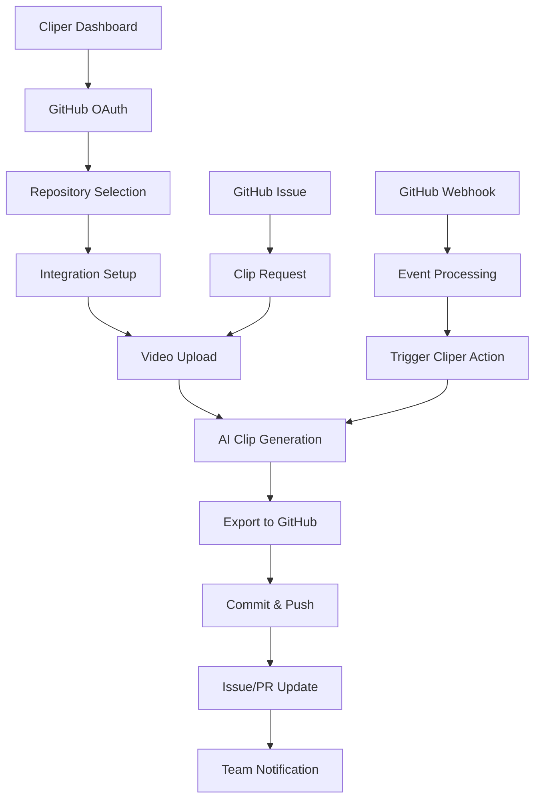

# GitHub Integration for Cliper - Product Requirements Document

## 1. Product Overview

Cliper GitHub Integration enables seamless bidirectional data exchange between the AI-powered video clip generation system and GitHub repositories, providing developers and content creators with automated workflow integration for video processing, version control, and collaborative content management.

The integration solves the problem of manual file management and disconnected workflows by automatically syncing video processing results with GitHub repositories, enabling teams to collaborate on video content creation while maintaining proper version control and project tracking.

This integration targets development teams, content creators, and organizations that need to manage video assets alongside their codebase, providing significant value through automated workflows and enhanced collaboration capabilities.

## 2. Core Features

### 2.1 User Roles

| Role | Registration Method | Core Permissions |
|------|---------------------|------------------|
| Repository Owner | GitHub OAuth authentication | Full repository access, webhook management, integration settings |
| Collaborator | GitHub OAuth with repository access | Read/write access to assigned repositories, clip generation, issue management |
| Viewer | GitHub OAuth with read access | View clips, download processed videos, read-only repository access |

### 2.2 Feature Module

Our GitHub integration requirements consist of the following main pages:

1. **GitHub Connection Page**: OAuth authentication flow, repository selection, permission configuration
2. **Repository Dashboard**: Repository overview, recent activity, integration status, webhook management
3. **Clip Export Manager**: Export clips to repositories, version control, automated commits
4. **Issue Tracker Integration**: Link clips to issues, automated issue creation, progress tracking
5. **Pull Request Manager**: Attach clips to PRs, review workflows, automated PR creation
6. **Webhook Configuration**: Real-time sync settings, event management, notification preferences
7. **Settings & Security**: Token management, access control, audit logs

### 2.3 Page Details

| Page Name | Module Name | Feature description |
|-----------|-------------|---------------------|
| GitHub Connection Page | OAuth Authentication | Implement secure GitHub OAuth 2.0 flow with scope selection and token management |
| GitHub Connection Page | Repository Selection | Display user repositories with filtering, search, and permission-based access control |
| GitHub Connection Page | Permission Configuration | Configure integration permissions, webhook settings, and access levels |
| Repository Dashboard | Repository Overview | Display repository information, recent commits, issues, and integration status |
| Repository Dashboard | Activity Feed | Show real-time updates from GitHub webhooks and Cliper processing events |
| Repository Dashboard | Integration Status | Monitor connection health, API rate limits, and sync status |
| Clip Export Manager | Export Configuration | Configure export settings, file naming conventions, and directory structure |
| Clip Export Manager | Version Control | Automatic commit creation with meaningful messages and metadata |
| Clip Export Manager | Batch Operations | Export multiple clips simultaneously with progress tracking |
| Issue Tracker Integration | Issue Linking | Associate video clips with GitHub issues using issue numbers or tags |
| Issue Tracker Integration | Automated Issue Creation | Create issues automatically when clip processing fails or requires review |
| Issue Tracker Integration | Progress Tracking | Update issue status based on clip processing progress and completion |
| Pull Request Manager | Clip Attachment | Attach generated clips to pull requests with preview and metadata |
| Pull Request Manager | Review Workflows | Integrate clip review process with GitHub PR review system |
| Pull Request Manager | Automated PR Creation | Create PRs automatically when clips are generated for specific branches |
| Webhook Configuration | Event Management | Configure which GitHub events trigger Cliper actions and vice versa |
| Webhook Configuration | Real-time Sync | Set up bidirectional synchronization between GitHub and Cliper |
| Webhook Configuration | Notification Settings | Configure notifications for integration events and status updates |
| Settings & Security | Token Management | Secure storage and rotation of GitHub access tokens and API keys |
| Settings & Security | Access Control | Manage user permissions and repository access levels |
| Settings & Security | Audit Logs | Track all integration activities, API calls, and security events |

## 3. Core Process

### Repository Owner Flow
1. **Authentication**: User initiates GitHub OAuth flow from Cliper dashboard
2. **Repository Selection**: Choose repositories to integrate with Cliper
3. **Permission Configuration**: Set up webhooks, access levels, and integration settings
4. **Clip Processing**: Upload videos to Cliper, process clips with AI analysis
5. **Export to GitHub**: Automatically commit generated clips to specified repository paths
6. **Issue Management**: Create or update GitHub issues based on processing results
7. **Collaboration**: Share clips with team members through GitHub's collaboration features

### Collaborator Flow
1. **Access Repository**: Access integrated repository through GitHub OAuth
2. **View Clips**: Browse existing clips and processing history
3. **Generate New Clips**: Upload videos and trigger clip generation
4. **Review Process**: Use GitHub PR system to review and approve clips
5. **Issue Tracking**: Create issues for clip requests or report processing problems

### Automated System Flow
1. **Webhook Reception**: Receive GitHub webhook events (push, PR, issue creation)
2. **Event Processing**: Analyze webhook payload and determine required actions
3. **Clip Generation**: Automatically process videos when new files are pushed
4. **Status Updates**: Update GitHub issues and PR status based on processing results
5. **Notification Delivery**: Send notifications through GitHub and Cliper channels

## 4. User Interface Design

### 4.1 Design Style

- **Primary Colors**: GitHub's signature colors - #24292e (dark), #0366d6 (blue), #28a745 (green)
- **Secondary Colors**: Cliper brand colors - #6366f1 (indigo), #8b5cf6 (purple), #f59e0b (amber)
- **Button Style**: Rounded corners (8px radius), subtle shadows, GitHub-style hover effects
- **Font**: Inter for headings, system fonts for body text, monospace for code snippets
- **Layout Style**: Card-based design with GitHub's clean aesthetic, top navigation with breadcrumbs
- **Icons**: GitHub Octicons combined with Heroicons for consistency

### 4.2 Page Design Overview

| Page Name | Module Name | UI Elements |
|-----------|-------------|-------------|
| GitHub Connection Page | OAuth Authentication | Large GitHub logo, "Connect with GitHub" button (dark theme), permission scope checklist, security badges |
| GitHub Connection Page | Repository Selection | Repository cards with avatars, star counts, language indicators, search bar with filters, pagination |
| Repository Dashboard | Activity Feed | Timeline layout with GitHub-style activity items, timestamps, user avatars, action icons |
| Repository Dashboard | Integration Status | Status indicators (green/yellow/red), progress bars, API rate limit meters, connection health badges |
| Clip Export Manager | Export Configuration | Form fields with GitHub styling, directory tree selector, file preview cards, export progress indicators |
| Issue Tracker Integration | Issue Linking | GitHub issue cards with labels, assignees, milestone indicators, link buttons, status badges |
| Pull Request Manager | Clip Attachment | PR cards with diff indicators, review status, clip thumbnails, attachment buttons, merge status |
| Webhook Configuration | Event Management | Toggle switches for events, webhook URL display, test buttons, event log table |
| Settings & Security | Token Management | Masked token displays, regenerate buttons, expiration indicators, security warnings |

### 4.3 Responsiveness

The integration is designed desktop-first with mobile-adaptive layouts. Touch interaction optimization is implemented for mobile devices, with larger touch targets for buttons and improved gesture support for repository browsing and clip management. The interface adapts to GitHub's responsive design patterns for consistency across devices.