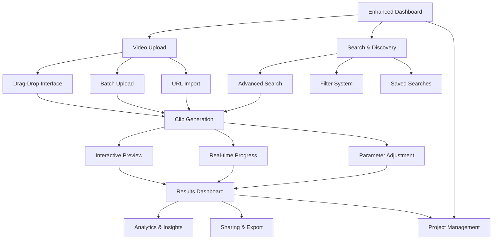

# Phase 4: User Experience Enhancement - Product Requirements Document

## 1. Product Overview

This document outlines the comprehensive user experience enhancements for the Cliper AI-powered video clip generation system. Building upon the existing working foundation of video processing, authentication, and basic UI, this phase focuses on creating a production-grade user experience with real-time updates, advanced search capabilities, and intuitive interfaces.

The enhancements will transform the current functional prototype into a polished, user-friendly SaaS platform that provides immediate feedback, powerful discovery tools, and seamless workflow management for content creators and video professionals.

## 2. Core Features

### 2.1 User Roles

| Role | Registration Method | Core Permissions |
|------|---------------------|------------------|
| Content Creator | Email registration + OAuth | Upload videos, generate clips, view analytics, manage projects |
| Pro User | Subscription upgrade | Batch operations, advanced analytics, priority processing, API access |
| Admin | Internal invitation | User management, system monitoring, feature flags, support tools |

### 2.2 Feature Module

Our user experience enhancement consists of the following main areas:

1. **Real-time Dashboard**: Live metrics, progress tracking, notification center, activity feed
2. **Advanced Search & Discovery**: Full-text search, faceted filters, saved searches, smart recommendations
3. **Enhanced Video Management**: Drag-drop upload, batch operations, project organization, version control
4. **Interactive Clip Generation**: Real-time preview, parameter adjustment, A/B testing, quality presets
5. **Notification System**: WebSocket updates, email/SMS alerts, preference management, digest options
6. **Analytics & Insights**: Performance metrics, viral score tracking, engagement analytics, export tools

### 2.3 Page Details

| Page Name | Module Name | Feature description |
|-----------|-------------|---------------------|
| Enhanced Dashboard | Real-time Metrics | Live job status, processing queue, system health indicators, recent activity feed |
| Enhanced Dashboard | Notification Center | In-app notifications, unread badges, notification history, quick actions |
| Enhanced Dashboard | Quick Actions | One-click upload, batch operations, template selection, recent projects |
| Search & Discovery | Advanced Search | Full-text search across videos/clips, autocomplete, search history |
| Search & Discovery | Filter System | Faceted search by date, duration, platform, viral score, tags |
| Search & Discovery | Saved Searches | Custom search queries, alerts for new matches, shared searches |
| Video Management | Enhanced Upload | Drag-drop interface, progress indicators, batch upload, URL import |
| Video Management | Project Organization | Folders, tags, collections, sharing permissions, version tracking |
| Video Management | Bulk Operations | Multi-select actions, batch processing, status monitoring |
| Clip Generation | Interactive Preview | Real-time preview, parameter sliders, before/after comparison |
| Clip Generation | Advanced Options | Platform optimization, quality presets, custom parameters, A/B testing |
| Clip Generation | Progress Tracking | Real-time updates, step-by-step progress, estimated completion time |
| Notification Settings | Preference Management | Channel selection, frequency settings, digest options, quiet hours |
| Notification Settings | Alert Configuration | Custom triggers, threshold settings, escalation rules |
| Analytics Dashboard | Performance Metrics | Viral score trends, engagement analytics, platform performance |
| Analytics Dashboard | Export Tools | Data export, report generation, API access, scheduled reports |

## 3. Core Process

### Content Creator Flow
1. **Dashboard Entry**: User lands on enhanced dashboard with real-time metrics and activity feed
2. **Video Upload**: Drag-drop or browse upload with real-time progress and batch capabilities
3. **Search & Discovery**: Use advanced search to find existing content or explore recommendations
4. **Clip Generation**: Configure parameters with interactive preview and real-time feedback
5. **Progress Monitoring**: Track processing with live updates and notifications
6. **Results Review**: Analyze generated clips with performance metrics and sharing options
7. **Project Management**: Organize content in folders, apply tags, and manage versions

### Admin Flow
1. **System Dashboard**: Monitor overall system health, user activity, and processing queues
2. **User Management**: View user analytics, manage permissions, and provide support
3. **Content Moderation**: Review flagged content, manage reports, and enforce policies
4. **Analytics Review**: Analyze platform metrics, performance trends, and usage patterns

## 4. User Interface Design

### 4.1 Design Style

**Color Palette:**
- Primary: #3B82F6 (Blue 500) - Action buttons, links, progress indicators
- Secondary: #10B981 (Emerald 500) - Success states, completion indicators
- Accent: #F59E0B (Amber 500) - Warnings, pending states
- Neutral: #6B7280 (Gray 500) - Text, borders, backgrounds
- Error: #EF4444 (Red 500) - Error states, destructive actions

**Typography:**
- Primary Font: Inter (system font fallback)
- Headings: 24px-32px, font-weight 600-700
- Body Text: 14px-16px, font-weight 400-500
- Captions: 12px-14px, font-weight 400

**Component Style:**
- Buttons: Rounded corners (8px), subtle shadows, hover animations
- Cards: Clean borders, subtle shadows, hover elevation
- Forms: Floating labels, inline validation, progressive disclosure
- Navigation: Sticky header, breadcrumbs, contextual actions

**Layout Principles:**
- Grid-based layout with 12-column system
- Consistent spacing (8px base unit)
- Responsive breakpoints: mobile (640px), tablet (768px), desktop (1024px)
- Card-based content organization
- Progressive disclosure for complex features

### 4.2 Page Design Overview

| Page Name | Module Name | UI Elements |
|-----------|-------------|-------------|
| Enhanced Dashboard | Real-time Metrics | Live charts with smooth animations, color-coded status indicators, progress bars with percentage labels, activity timeline with icons |
| Enhanced Dashboard | Notification Center | Sliding panel with unread badges, categorized notifications, quick action buttons, dismiss/mark read controls |
| Search & Discovery | Advanced Search | Prominent search bar with autocomplete dropdown, filter chips with clear actions, results grid with hover previews |
| Search & Discovery | Filter System | Collapsible filter sidebar, range sliders for numerical values, multi-select dropdowns, applied filter tags |
| Video Management | Enhanced Upload | Drag-drop zone with visual feedback, progress indicators with cancel options, thumbnail previews, batch status list |
| Video Management | Project Organization | Tree view navigation, drag-drop folder management, tag input with suggestions, sharing modal dialogs |
| Clip Generation | Interactive Preview | Split-screen layout, parameter sliders with real-time preview, before/after comparison toggle, quality selector |
| Clip Generation | Progress Tracking | Step-by-step progress indicator, estimated time remaining, real-time log viewer, cancel/retry buttons |
| Notification Settings | Preference Management | Toggle switches for channels, frequency dropdowns, time picker for quiet hours, preview examples |
| Analytics Dashboard | Performance Metrics | Interactive charts with drill-down, metric cards with trend indicators, comparison tools, export buttons |

### 4.3 Responsiveness

**Design Approach:** Mobile-first responsive design with progressive enhancement

**Breakpoint Strategy:**
- Mobile (320px-640px): Single column layout, collapsible navigation, touch-optimized controls
- Tablet (641px-1024px): Two-column layout, sidebar navigation, hybrid touch/mouse interactions
- Desktop (1025px+): Multi-column layout, persistent navigation, mouse-optimized interactions

**Touch Optimization:**
- Minimum touch target size: 44px
- Gesture support: swipe navigation, pinch-to-zoom for previews
- Touch-friendly form controls and interactive elements
- Haptic feedback for mobile interactions

**Performance Considerations:**
- Lazy loading for images and videos
- Progressive image enhancement
- Optimized bundle sizes for mobile
- Service worker for offline functionality