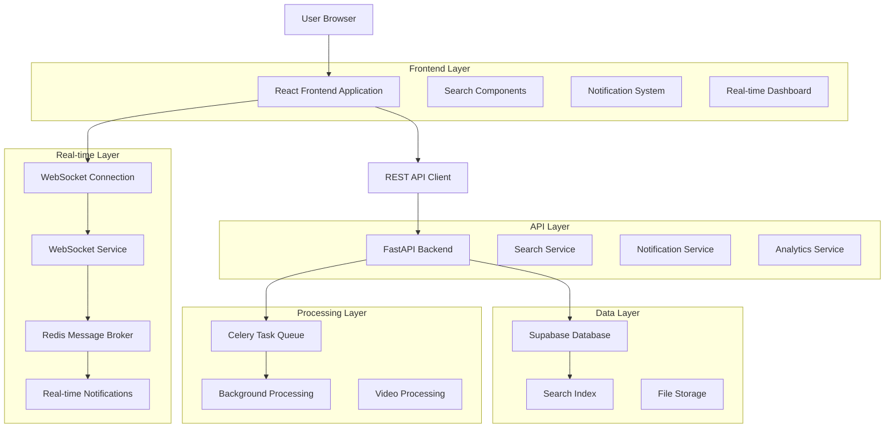
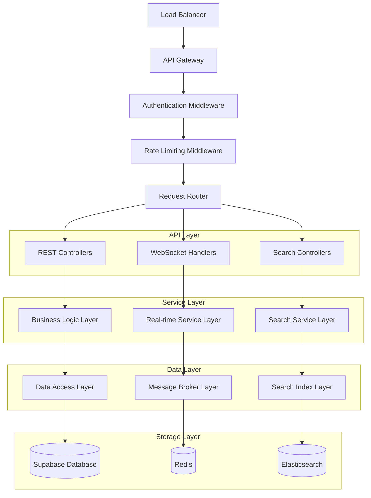
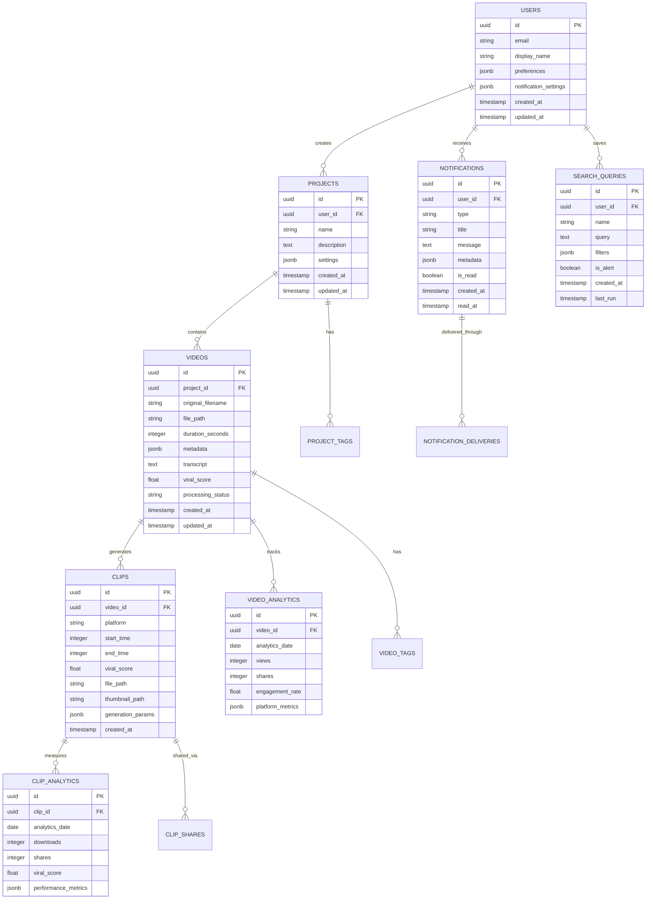

# Phase 4: User Experience Enhancement - Technical Architecture Document

## 1. Architecture Design



## 2. Technology Description

**Frontend Enhancements:**
- React@18 + TypeScript for type-safe component development
- TailwindCSS@3 for responsive design system
- Framer Motion for smooth animations and transitions
- React Query for efficient data fetching and caching
- Zustand for lightweight state management
- React Hook Form for optimized form handling

**Real-time Communication:**
- WebSocket API for bidirectional real-time communication
- Socket.IO client for connection management and fallbacks
- Server-Sent Events (SSE) as WebSocket fallback

**Backend Services:**
- FastAPI with WebSocket support for real-time endpoints
- Redis for WebSocket message brokering and session management
- Elasticsearch/OpenSearch for advanced search capabilities
- Celery for background task processing

**Database & Storage:**
- Supabase (PostgreSQL) for primary data storage
- Redis for caching and real-time data
- Full-text search indexes for content discovery

## 3. Route Definitions

| Route | Purpose |
|-------|---------|
| `/dashboard` | Enhanced dashboard with real-time metrics and activity feed |
| `/search` | Advanced search interface with filters and saved searches |
| `/upload` | Enhanced upload interface with drag-drop and batch capabilities |
| `/projects` | Project management with folders, tags, and organization |
| `/clips/generate` | Interactive clip generation with real-time preview |
| `/analytics` | Comprehensive analytics dashboard with insights |
| `/notifications` | Notification center and preference management |
| `/settings/notifications` | Notification configuration and channel management |
| `/ws/updates` | WebSocket endpoint for real-time updates |
| `/ws/progress/{job_id}` | Job-specific progress tracking WebSocket |

## 4. API Definitions

### 4.1 Real-time Communication APIs

**WebSocket Connection**
```
WS /ws/updates
```

Connection Parameters:
| Param Name | Param Type | isRequired | Description |
|------------|------------|------------|-------------|
| user_id | string | true | Authenticated user identifier |
| client_id | string | true | Unique client session identifier |

Message Types:
| Message Type | Description |
|--------------|-------------|
| job_progress | Real-time job processing updates |
| clip_generated | New clip generation completion |
| notification | In-app notification delivery |
| system_status | System health and maintenance updates |

**Search API**
```
POST /api/v1/search
```

Request:
| Param Name | Param Type | isRequired | Description |
|------------|------------|------------|-------------|
| query | string | false | Full-text search query |
| filters | object | false | Faceted search filters |
| sort | string | false | Sort criteria (relevance, date, score) |
| limit | integer | false | Results per page (default: 20) |
| offset | integer | false | Pagination offset |

Response:
| Param Name | Param Type | Description |
|------------|------------|-------------|
| results | array | Search result items |
| total | integer | Total matching results |
| facets | object | Available filter facets |
| suggestions | array | Search query suggestions |

Example Request:
```json
{
  "query": "viral content",
  "filters": {
    "platform": ["youtube", "tiktok"],
    "duration": {"min": 30, "max": 120},
    "viral_score": {"min": 0.7}
  },
  "sort": "viral_score_desc",
  "limit": 20,
  "offset": 0
}
```

**Notification API**
```
POST /api/v1/notifications/send
```

Request:
| Param Name | Param Type | isRequired | Description |
|------------|------------|------------|-------------|
| user_id | string | true | Target user identifier |
| type | string | true | Notification type (info, success, warning, error) |
| title | string | true | Notification title |
| message | string | true | Notification content |
| channels | array | false | Delivery channels (in_app, email, sms) |
| metadata | object | false | Additional notification data |

**Analytics API**
```
GET /api/v1/analytics/dashboard
```

Response:
| Param Name | Param Type | Description |
|------------|------------|-------------|
| metrics | object | Key performance metrics |
| trends | array | Time-series trend data |
| top_content | array | Best performing content |
| user_activity | object | User engagement metrics |

### 4.2 Enhanced Upload API

**Batch Upload**
```
POST /api/v1/videos/batch-upload
```

Request (multipart/form-data):
| Param Name | Param Type | isRequired | Description |
|------------|------------|------------|-------------|
| files | array | true | Multiple video files |
| project_id | string | false | Target project identifier |
| tags | array | false | Content tags |
| processing_options | object | false | Batch processing configuration |

**Upload Progress**
```
GET /api/v1/videos/upload-progress/{upload_id}
```

Response:
| Param Name | Param Type | Description |
|------------|------------|-------------|
| upload_id | string | Upload session identifier |
| progress | number | Upload progress percentage |
| files_completed | integer | Number of files processed |
| files_total | integer | Total number of files |
| estimated_remaining | integer | Estimated seconds remaining |

## 5. Server Architecture Diagram



## 6. Data Model

### 6.1 Data Model Definition



### 6.2 Data Definition Language

**Enhanced Users Table**
```sql
-- Add notification preferences to users table
ALTER TABLE users ADD COLUMN IF NOT EXISTS notification_settings JSONB DEFAULT '{
  "in_app": true,
  "email": true,
  "sms": false,
  "digest_frequency": "daily",
  "quiet_hours": {"start": "22:00", "end": "08:00"}
}'::jsonb;

-- Add user preferences
ALTER TABLE users ADD COLUMN IF NOT EXISTS preferences JSONB DEFAULT '{
  "theme": "light",
  "language": "en",
  "timezone": "UTC",
  "dashboard_layout": "default"
}'::jsonb;

-- Create indexes for JSON queries
CREATE INDEX IF NOT EXISTS idx_users_notification_settings ON users USING GIN (notification_settings);
CREATE INDEX IF NOT EXISTS idx_users_preferences ON users USING GIN (preferences);
```

**Projects Table**
```sql
CREATE TABLE IF NOT EXISTS projects (
    id UUID PRIMARY KEY DEFAULT gen_random_uuid(),
    user_id UUID NOT NULL REFERENCES users(id) ON DELETE CASCADE,
    name VARCHAR(255) NOT NULL,
    description TEXT,
    settings JSONB DEFAULT '{
      "auto_generate_clips": true,
      "default_platforms": ["youtube", "tiktok"],
      "quality_preset": "high"
    }'::jsonb,
    created_at TIMESTAMP WITH TIME ZONE DEFAULT NOW(),
    updated_at TIMESTAMP WITH TIME ZONE DEFAULT NOW()
);

CREATE INDEX idx_projects_user_id ON projects(user_id);
CREATE INDEX idx_projects_settings ON projects USING GIN (settings);
```

**Enhanced Videos Table**
```sql
-- Add full-text search support
ALTER TABLE videos ADD COLUMN IF NOT EXISTS search_vector tsvector;

-- Create full-text search index
CREATE INDEX IF NOT EXISTS idx_videos_search ON videos USING GIN (search_vector);

-- Add trigger to update search vector
CREATE OR REPLACE FUNCTION update_video_search_vector()
RETURNS TRIGGER AS $$
BEGIN
    NEW.search_vector := 
        setweight(to_tsvector('english', COALESCE(NEW.original_filename, '')), 'A') ||
        setweight(to_tsvector('english', COALESCE(NEW.transcript, '')), 'B') ||
        setweight(to_tsvector('english', COALESCE(NEW.metadata->>'description', '')), 'C');
    RETURN NEW;
END;
$$ LANGUAGE plpgsql;

CREATE TRIGGER trigger_update_video_search_vector
    BEFORE INSERT OR UPDATE ON videos
    FOR EACH ROW EXECUTE FUNCTION update_video_search_vector();
```

**Notifications Table**
```sql
CREATE TABLE IF NOT EXISTS notifications (
    id UUID PRIMARY KEY DEFAULT gen_random_uuid(),
    user_id UUID NOT NULL REFERENCES users(id) ON DELETE CASCADE,
    type VARCHAR(50) NOT NULL CHECK (type IN ('info', 'success', 'warning', 'error')),
    title VARCHAR(255) NOT NULL,
    message TEXT NOT NULL,
    metadata JSONB DEFAULT '{}'::jsonb,
    is_read BOOLEAN DEFAULT FALSE,
    created_at TIMESTAMP WITH TIME ZONE DEFAULT NOW(),
    read_at TIMESTAMP WITH TIME ZONE
);

CREATE INDEX idx_notifications_user_id ON notifications(user_id);
CREATE INDEX idx_notifications_created_at ON notifications(created_at DESC);
CREATE INDEX idx_notifications_is_read ON notifications(is_read) WHERE is_read = FALSE;
```

**Saved Search Queries Table**
```sql
CREATE TABLE IF NOT EXISTS search_queries (
    id UUID PRIMARY KEY DEFAULT gen_random_uuid(),
    user_id UUID NOT NULL REFERENCES users(id) ON DELETE CASCADE,
    name VARCHAR(255) NOT NULL,
    query TEXT,
    filters JSONB DEFAULT '{}'::jsonb,
    is_alert BOOLEAN DEFAULT FALSE,
    created_at TIMESTAMP WITH TIME ZONE DEFAULT NOW(),
    last_run TIMESTAMP WITH TIME ZONE
);

CREATE INDEX idx_search_queries_user_id ON search_queries(user_id);
CREATE INDEX idx_search_queries_is_alert ON search_queries(is_alert) WHERE is_alert = TRUE;
```

**Analytics Tables**
```sql
CREATE TABLE IF NOT EXISTS video_analytics (
    id UUID PRIMARY KEY DEFAULT gen_random_uuid(),
    video_id UUID NOT NULL REFERENCES videos(id) ON DELETE CASCADE,
    analytics_date DATE NOT NULL,
    views INTEGER DEFAULT 0,
    shares INTEGER DEFAULT 0,
    engagement_rate FLOAT DEFAULT 0.0,
    platform_metrics JSONB DEFAULT '{}'::jsonb,
    UNIQUE(video_id, analytics_date)
);

CREATE TABLE IF NOT EXISTS clip_analytics (
    id UUID PRIMARY KEY DEFAULT gen_random_uuid(),
    clip_id UUID NOT NULL REFERENCES clips(id) ON DELETE CASCADE,
    analytics_date DATE NOT NULL,
    downloads INTEGER DEFAULT 0,
    shares INTEGER DEFAULT 0,
    viral_score FLOAT DEFAULT 0.0,
    performance_metrics JSONB DEFAULT '{}'::jsonb,
    UNIQUE(clip_id, analytics_date)
);

-- Indexes for analytics queries
CREATE INDEX idx_video_analytics_date ON video_analytics(analytics_date DESC);
CREATE INDEX idx_clip_analytics_date ON clip_analytics(analytics_date DESC);
CREATE INDEX idx_video_analytics_video_id ON video_analytics(video_id);
CREATE INDEX idx_clip_analytics_clip_id ON clip_analytics(clip_id);
```

**Initial Data**
```sql
-- Insert sample notification types
INSERT INTO notifications (user_id, type, title, message, metadata) VALUES
('00000000-0000-0000-0000-000000000001', 'info', 'Welcome to Cliper!', 'Your account has been successfully created. Start by uploading your first video.', '{"action": "upload", "url": "/upload"}'),
('00000000-0000-0000-0000-000000000001', 'success', 'Video Processing Complete', 'Your video "Sample Video.mp4" has been successfully processed and is ready for clip generation.', '{"video_id": "sample-video-id", "action": "generate_clips"}');

-- Insert sample search queries
INSERT INTO search_queries (user_id, name, query, filters, is_alert) VALUES
('00000000-0000-0000-0000-000000000001', 'High Viral Score Videos', '', '{"viral_score": {"min": 0.8}}', true),
('00000000-0000-0000-0000-000000000001', 'Recent TikTok Clips', 'tiktok', '{"platform": ["tiktok"], "created_at": {"days": 7}}', false);
```