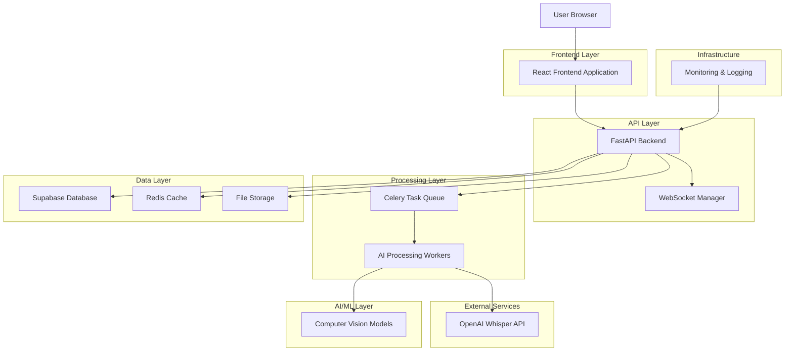
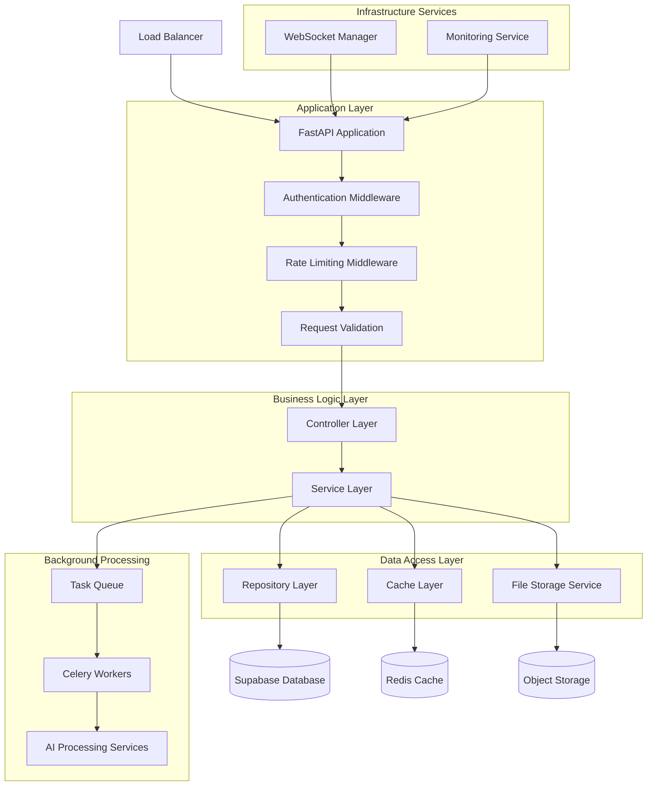
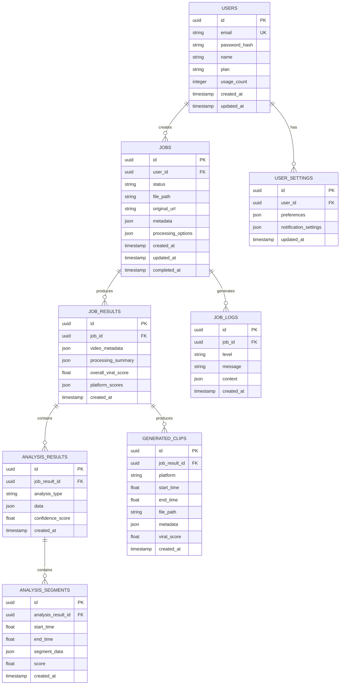

# Cliper - Production Technical Architecture Document

## 1. Architecture Design



## 2. Technology Description

### Frontend Stack
- **React@18** - Modern UI framework with hooks and concurrent features
- **TypeScript@5** - Type safety and enhanced developer experience
- **Tailwind CSS@3** - Utility-first CSS framework for rapid styling
- **Vite@4** - Fast build tool and development server
- **React Query@4** - Server state management and caching
- **Socket.io-client@4** - Real-time communication with backend
- **React Hook Form@7** - Performant form handling with validation
- **Recharts@2** - Data visualization for analytics

### Backend Stack
- **FastAPI@0.104** - High-performance async Python web framework
- **Celery@5.3** - Distributed task queue for background processing
- **Redis@7** - In-memory cache and message broker
- **SQLAlchemy@2.0** - ORM for database operations
- **Alembic@1.12** - Database migration management
- **Pydantic@2.0** - Data validation and serialization
- **Socket.io@5** - Real-time WebSocket communication
- **Uvicorn@0.24** - ASGI server for FastAPI

### AI/ML Stack
- **OpenAI Whisper** - Speech-to-text transcription
- **OpenCV@4.8** - Computer vision and video processing
- **MediaPipe@0.10** - Face detection and pose estimation
- **NLTK@3.8** - Natural language processing
- **scikit-learn@1.3** - Machine learning algorithms
- **TensorFlow@2.13** - Deep learning models
- **FFmpeg** - Video/audio processing and conversion

### Database & Storage
- **Supabase (PostgreSQL@15)** - Primary database with real-time features
- **Redis@7** - Caching and session storage
- **Supabase Storage** - File storage for videos and generated clips
- **MinIO** - Self-hosted object storage (alternative)

### Infrastructure & DevOps
- **Docker@24** - Containerization
- **Docker Compose** - Local development orchestration
- **GitHub Actions** - CI/CD pipeline
- **Sentry** - Error tracking and performance monitoring
- **Prometheus** - Metrics collection
- **Grafana** - Monitoring dashboards

## 3. Route Definitions

### Frontend Routes
| Route | Purpose | Authentication Required |
|-------|---------|------------------------|
| / | Landing page with upload interface | No |
| /dashboard | User dashboard with job monitoring | Yes |
| /results/:jobId | Detailed analysis results and clip generation | Yes |
| /history | User's processing history and analytics | Yes |
| /settings | User preferences and account management | Yes |
| /login | User authentication | No |
| /register | User registration | No |
| /forgot-password | Password reset | No |

### API Route Structure
```
/api/v1/
├── auth/
│   ├── login
│   ├── register
│   ├── logout
│   ├── refresh
│   └── forgot-password
├── users/
│   ├── profile
│   ├── settings
│   └── analytics
├── jobs/
│   ├── create
│   ├── {job_id}/status
│   ├── {job_id}/results
│   ├── {job_id}/analysis
│   └── {job_id}/clips
├── upload/
│   ├── video
│   └── url
├── clips/
│   ├── generate
│   ├── download
│   └── share
└── health/
    ├── status
    └── metrics
```

## 4. API Definitions

### 4.1 Authentication APIs

#### User Login
```
POST /api/v1/auth/login
```

**Request:**
| Param Name | Param Type | Required | Description |
|------------|------------|----------|-------------|
| email | string | true | User email address |
| password | string | true | User password |

**Response:**
| Param Name | Param Type | Description |
|------------|------------|-------------|
| access_token | string | JWT access token |
| refresh_token | string | JWT refresh token |
| user | object | User profile information |
| expires_in | number | Token expiration time in seconds |

**Example Request:**
```json
{
  "email": "user@example.com",
  "password": "securepassword123"
}
```

**Example Response:**
```json
{
  "access_token": "eyJhbGciOiJIUzI1NiIsInR5cCI6IkpXVCJ9...",
  "refresh_token": "eyJhbGciOiJIUzI1NiIsInR5cCI6IkpXVCJ9...",
  "user": {
    "id": "uuid-string",
    "email": "user@example.com",
    "name": "John Doe",
    "created_at": "2024-01-01T00:00:00Z"
  },
  "expires_in": 3600
}
```

### 4.2 Job Management APIs

#### Create Video Processing Job
```
POST /api/v1/jobs/create
```

**Request:**
| Param Name | Param Type | Required | Description |
|------------|------------|----------|-------------|
| video_file | file | conditional | Video file upload (multipart/form-data) |
| video_url | string | conditional | URL to video file |
| processing_options | object | false | Processing preferences |

**Response:**
| Param Name | Param Type | Description |
|------------|------------|-------------|
| job_id | string | Unique job identifier |
| status | string | Initial job status |
| estimated_duration | number | Estimated processing time in seconds |
| created_at | string | Job creation timestamp |

#### Get Job Status
```
GET /api/v1/jobs/{job_id}/status
```

**Response:**
| Param Name | Param Type | Description |
|------------|------------|-------------|
| job_id | string | Job identifier |
| status | string | Current status (pending, processing, completed, failed) |
| progress | number | Processing progress (0-100) |
| current_stage | string | Current processing stage |
| estimated_remaining | number | Estimated remaining time in seconds |
| error_message | string | Error details if status is failed |

### 4.3 Analysis Results APIs

#### Get Detailed Analysis
```
GET /api/v1/jobs/{job_id}/analysis
```

**Response:**
| Param Name | Param Type | Description |
|------------|------------|-------------|
| job_id | string | Job identifier |
| video_metadata | object | Video file information |
| transcript | object | Speech recognition results |
| visual_analysis | object | Scene detection and object recognition |
| emotion_analysis | object | Facial emotion and sentiment analysis |
| viral_score | object | Viral potential scoring |
| recommended_clips | array | AI-recommended clip segments |

**Example Response:**
```json
{
  "job_id": "job-uuid",
  "video_metadata": {
    "duration": 600,
    "resolution": "1920x1080",
    "fps": 30,
    "file_size": 104857600
  },
  "transcript": {
    "language": "en",
    "confidence": 0.95,
    "segments": [
      {
        "start_time": 0.0,
        "end_time": 5.2,
        "text": "Welcome to our video tutorial",
        "confidence": 0.98
      }
    ]
  },
  "viral_score": {
    "overall_score": 8.5,
    "platform_scores": {
      "tiktok": 9.2,
      "instagram": 8.1,
      "youtube_shorts": 7.8
    },
    "factors": {
      "engagement_potential": 8.7,
      "trend_alignment": 8.2,
      "content_quality": 8.9
    }
  },
  "recommended_clips": [
    {
      "start_time": 45.2,
      "end_time": 60.8,
      "score": 9.1,
      "reason": "High engagement moment with emotional peak",
      "platform_optimization": "tiktok"
    }
  ]
}
```

### 4.4 Clip Generation APIs

#### Generate Clips
```
POST /api/v1/jobs/{job_id}/clips
```

**Request:**
| Param Name | Param Type | Required | Description |
|------------|------------|----------|-------------|
| clip_segments | array | true | Array of clip definitions |
| platform | string | true | Target platform (tiktok, instagram, youtube) |
| quality | string | false | Output quality (high, medium, low) |

**Response:**
| Param Name | Param Type | Description |
|------------|------------|-------------|
| generation_job_id | string | Clip generation job ID |
| estimated_duration | number | Estimated generation time |
| clips_count | number | Number of clips to be generated |

## 5. Server Architecture Diagram



## 6. Data Model

### 6.1 Data Model Definition



### 6.2 Data Definition Language

#### Users Table
```sql
-- Create users table
CREATE TABLE users (
    id UUID PRIMARY KEY DEFAULT gen_random_uuid(),
    email VARCHAR(255) UNIQUE NOT NULL,
    password_hash VARCHAR(255) NOT NULL,
    name VARCHAR(100) NOT NULL,
    plan VARCHAR(20) DEFAULT 'free' CHECK (plan IN ('free', 'premium', 'enterprise')),
    usage_count INTEGER DEFAULT 0,
    created_at TIMESTAMP WITH TIME ZONE DEFAULT NOW(),
    updated_at TIMESTAMP WITH TIME ZONE DEFAULT NOW()
);

-- Create indexes
CREATE INDEX idx_users_email ON users(email);
CREATE INDEX idx_users_plan ON users(plan);
CREATE INDEX idx_users_created_at ON users(created_at DESC);

-- Grant permissions
GRANT SELECT ON users TO anon;
GRANT ALL PRIVILEGES ON users TO authenticated;
```

#### User Settings Table
```sql
-- Create user_settings table
CREATE TABLE user_settings (
    id UUID PRIMARY KEY DEFAULT gen_random_uuid(),
    user_id UUID NOT NULL REFERENCES users(id) ON DELETE CASCADE,
    preferences JSONB DEFAULT '{}',
    notification_settings JSONB DEFAULT '{
        "email_notifications": true,
        "push_notifications": true,
        "job_completion": true,
        "weekly_summary": false
    }',
    updated_at TIMESTAMP WITH TIME ZONE DEFAULT NOW()
);

-- Create indexes
CREATE UNIQUE INDEX idx_user_settings_user_id ON user_settings(user_id);
CREATE INDEX idx_user_settings_updated_at ON user_settings(updated_at DESC);

-- Grant permissions
GRANT ALL PRIVILEGES ON user_settings TO authenticated;
```

#### Jobs Table
```sql
-- Create jobs table
CREATE TABLE jobs (
    id UUID PRIMARY KEY DEFAULT gen_random_uuid(),
    user_id UUID NOT NULL REFERENCES users(id) ON DELETE CASCADE,
    status VARCHAR(20) DEFAULT 'pending' CHECK (status IN (
        'pending', 'processing', 'completed', 'failed', 'cancelled'
    )),
    file_path VARCHAR(500),
    original_url VARCHAR(1000),
    metadata JSONB DEFAULT '{}',
    processing_options JSONB DEFAULT '{
        "quality": "high",
        "platforms": ["tiktok", "instagram", "youtube"],
        "max_clips": 5
    }',
    created_at TIMESTAMP WITH TIME ZONE DEFAULT NOW(),
    updated_at TIMESTAMP WITH TIME ZONE DEFAULT NOW(),
    completed_at TIMESTAMP WITH TIME ZONE
);

-- Create indexes
CREATE INDEX idx_jobs_user_id ON jobs(user_id);
CREATE INDEX idx_jobs_status ON jobs(status);
CREATE INDEX idx_jobs_created_at ON jobs(created_at DESC);
CREATE INDEX idx_jobs_user_status ON jobs(user_id, status);

-- Grant permissions
GRANT SELECT ON jobs TO anon;
GRANT ALL PRIVILEGES ON jobs TO authenticated;
```

#### Job Results Table
```sql
-- Create job_results table
CREATE TABLE job_results (
    id UUID PRIMARY KEY DEFAULT gen_random_uuid(),
    job_id UUID NOT NULL REFERENCES jobs(id) ON DELETE CASCADE,
    video_metadata JSONB DEFAULT '{}',
    processing_summary JSONB DEFAULT '{}',
    overall_viral_score DECIMAL(3,2) CHECK (overall_viral_score >= 0 AND overall_viral_score <= 10),
    platform_scores JSONB DEFAULT '{}',
    created_at TIMESTAMP WITH TIME ZONE DEFAULT NOW()
);

-- Create indexes
CREATE UNIQUE INDEX idx_job_results_job_id ON job_results(job_id);
CREATE INDEX idx_job_results_viral_score ON job_results(overall_viral_score DESC);
CREATE INDEX idx_job_results_created_at ON job_results(created_at DESC);

-- Grant permissions
GRANT ALL PRIVILEGES ON job_results TO authenticated;
```

#### Analysis Results Table
```sql
-- Create analysis_results table
CREATE TABLE analysis_results (
    id UUID PRIMARY KEY DEFAULT gen_random_uuid(),
    job_result_id UUID NOT NULL REFERENCES job_results(id) ON DELETE CASCADE,
    analysis_type VARCHAR(50) NOT NULL CHECK (analysis_type IN (
        'transcript', 'visual_analysis', 'emotion_analysis', 'scene_detection'
    )),
    data JSONB NOT NULL,
    confidence_score DECIMAL(3,2) CHECK (confidence_score >= 0 AND confidence_score <= 1),
    created_at TIMESTAMP WITH TIME ZONE DEFAULT NOW()
);

-- Create indexes
CREATE INDEX idx_analysis_results_job_result_id ON analysis_results(job_result_id);
CREATE INDEX idx_analysis_results_type ON analysis_results(analysis_type);
CREATE INDEX idx_analysis_results_confidence ON analysis_results(confidence_score DESC);

-- Grant permissions
GRANT ALL PRIVILEGES ON analysis_results TO authenticated;
```

#### Generated Clips Table
```sql
-- Create generated_clips table
CREATE TABLE generated_clips (
    id UUID PRIMARY KEY DEFAULT gen_random_uuid(),
    job_result_id UUID NOT NULL REFERENCES job_results(id) ON DELETE CASCADE,
    platform VARCHAR(20) NOT NULL CHECK (platform IN ('tiktok', 'instagram', 'youtube', 'twitter')),
    start_time DECIMAL(10,3) NOT NULL,
    end_time DECIMAL(10,3) NOT NULL,
    file_path VARCHAR(500) NOT NULL,
    metadata JSONB DEFAULT '{}',
    viral_score DECIMAL(3,2) CHECK (viral_score >= 0 AND viral_score <= 10),
    created_at TIMESTAMP WITH TIME ZONE DEFAULT NOW()
);

-- Create indexes
CREATE INDEX idx_generated_clips_job_result_id ON generated_clips(job_result_id);
CREATE INDEX idx_generated_clips_platform ON generated_clips(platform);
CREATE INDEX idx_generated_clips_viral_score ON generated_clips(viral_score DESC);
CREATE INDEX idx_generated_clips_created_at ON generated_clips(created_at DESC);

-- Grant permissions
GRANT ALL PRIVILEGES ON generated_clips TO authenticated;
```

#### Initial Data
```sql
-- Insert sample user for development
INSERT INTO users (email, password_hash, name, plan) VALUES
('demo@cliper.ai', '$2b$12$LQv3c1yqBWVHxkd0LHAkCOYz6TtxMQJqhN8/LewdBPj6hsxq5S/kS', 'Demo User', 'premium');

-- Insert sample user settings
INSERT INTO user_settings (user_id, preferences, notification_settings)
SELECT 
    id,
    '{
        "default_quality": "high",
        "preferred_platforms": ["tiktok", "instagram"],
        "auto_generate_clips": true,
        "max_clips_per_job": 5
    }',
    '{
        "email_notifications": true,
        "push_notifications": false,
        "job_completion": true,
        "weekly_summary": true
    }'
FROM users WHERE email = 'demo@cliper.ai';
```

## 7. Security Architecture

### 7.1 Authentication & Authorization
- **JWT Tokens**: Stateless authentication with access/refresh token pattern
- **Supabase Auth**: Integrated authentication with social login support
- **Role-Based Access**: User roles (free, premium, enterprise) with feature restrictions
- **API Key Management**: Secure storage and rotation of external API keys

### 7.2 Data Protection
- **Encryption at Rest**: Database encryption using Supabase built-in encryption
- **Encryption in Transit**: TLS 1.3 for all API communications
- **File Security**: Signed URLs for temporary file access
- **PII Protection**: Minimal personal data collection with anonymization options

### 7.3 Input Validation & Sanitization
- **Pydantic Models**: Comprehensive input validation for all API endpoints
- **File Upload Security**: File type validation, size limits, virus scanning
- **SQL Injection Prevention**: Parameterized queries through SQLAlchemy ORM
- **XSS Protection**: Content Security Policy and input sanitization

### 7.4 Rate Limiting & DDoS Protection
- **API Rate Limiting**: Per-user and per-endpoint rate limits
- **Upload Limits**: File size and frequency restrictions
- **Processing Quotas**: Usage-based limits per subscription tier
- **IP-based Protection**: Suspicious activity detection and blocking

## 8. Performance & Scalability

### 8.1 Caching Strategy
- **Redis Cache**: API response caching with TTL-based invalidation
- **CDN Integration**: Static asset delivery through CDN
- **Database Query Caching**: Frequently accessed data caching
- **Browser Caching**: Optimized cache headers for static resources

### 8.2 Database Optimization
- **Connection Pooling**: Efficient database connection management
- **Query Optimization**: Indexed queries and query plan analysis
- **Read Replicas**: Separate read/write database instances
- **Partitioning**: Time-based partitioning for large tables

### 8.3 Horizontal Scaling
- **Stateless Design**: Horizontally scalable application architecture
- **Load Balancing**: Multiple application instances behind load balancer
- **Worker Scaling**: Auto-scaling Celery workers based on queue length
- **Database Scaling**: Supabase automatic scaling capabilities

### 8.4 Performance Monitoring
- **APM Integration**: Application performance monitoring with Sentry
- **Custom Metrics**: Business-specific metrics collection
- **Real-time Dashboards**: Grafana dashboards for system monitoring
- **Alerting**: Automated alerts for performance degradation

## 9. Deployment Architecture

### 9.1 Environment Strategy
- **Development**: Local Docker Compose setup
- **Staging**: Production-like environment for testing
- **Production**: High-availability deployment with redundancy
- **Feature Environments**: Temporary environments for feature testing

### 9.2 CI/CD Pipeline
- **Source Control**: Git-based workflow with feature branches
- **Automated Testing**: Unit, integration, and E2E tests in pipeline
- **Security Scanning**: Vulnerability and dependency scanning
- **Deployment Automation**: Zero-downtime deployments with rollback capability

### 9.3 Infrastructure as Code
- **Container Orchestration**: Docker containers with orchestration
- **Configuration Management**: Environment-specific configuration
- **Secret Management**: Secure handling of API keys and credentials
- **Backup Strategy**: Automated database and file backups

## 10. Monitoring & Observability

### 10.1 Logging Strategy
- **Structured Logging**: JSON-formatted logs with correlation IDs
- **Log Aggregation**: Centralized log collection and analysis
- **Log Retention**: Configurable retention policies by environment
- **Security Logging**: Audit trails for security-relevant events

### 10.2 Metrics Collection
- **System Metrics**: CPU, memory, disk, network utilization
- **Application Metrics**: Request rates, response times, error rates
- **Business Metrics**: User engagement, processing success rates
- **Custom Metrics**: AI model performance and accuracy metrics

### 10.3 Alerting & Incident Response
- **Threshold-based Alerts**: Automated alerts for metric thresholds
- **Anomaly Detection**: ML-based anomaly detection for unusual patterns
- **Escalation Procedures**: Tiered alerting with escalation paths
- **Incident Management**: Structured incident response procedures

This technical architecture provides a robust foundation for building a scalable, secure, and maintainable video analysis platform that can handle production workloads while maintaining high performance and reliability.