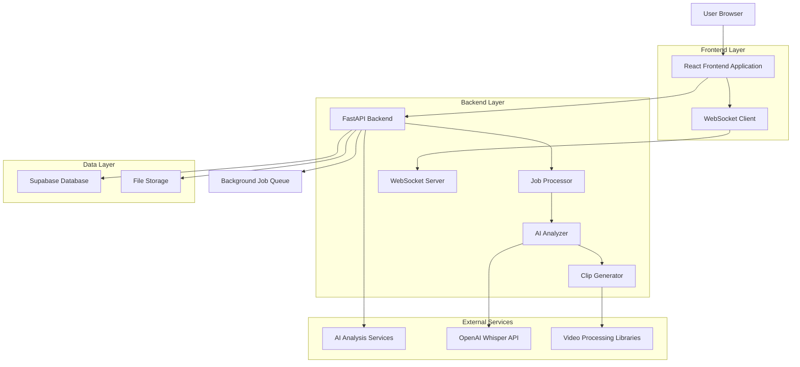
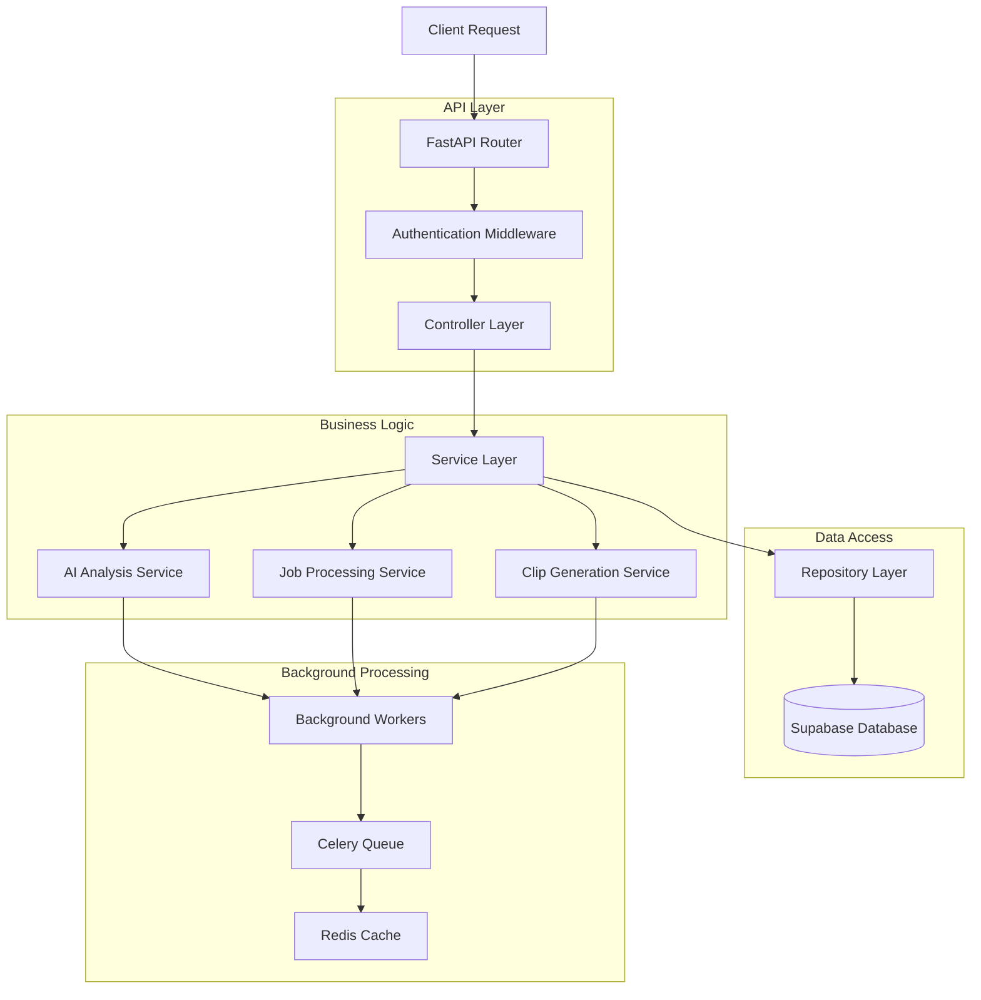
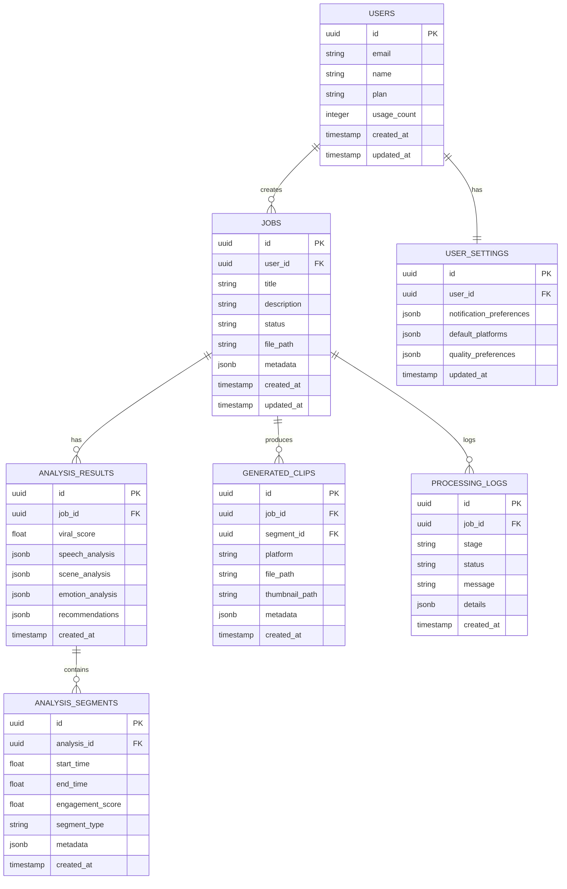

# Cliper Video Analysis Application - Technical Architecture Plan

## 1. Architecture Design



## 2. Technology Description

- Frontend: React@18 + TypeScript + Tailwind CSS + Vite
- Backend: FastAPI + Python 3.9+ + Pydantic + SQLAlchemy
- Database: Supabase (PostgreSQL)
- File Storage: Supabase Storage
- AI/ML: OpenAI Whisper + OpenCV + TensorFlow + scikit-learn
- Real-time: WebSocket (FastAPI WebSocket)
- Background Jobs: Celery + Redis
- Authentication: Supabase Auth

## 3. Route Definitions

| Route | Purpose |
|-------|----------|
| / | Home page with upload interface and feature overview |
| /login | User authentication page |
| /register | User registration page |
| /dashboard | Main dashboard with job overview and analytics |
| /upload | Video upload interface with progress tracking |
| /results/:jobId | Detailed analysis results and clip generation |
| /history | Processing history and analytics |
| /settings | User settings and preferences |
| /profile | User profile management |

## 4. API Definitions

### 4.1 Authentication APIs

**User Login**
```
POST /api/auth/login
```

Request:
| Param Name | Param Type | isRequired | Description |
|------------|------------|------------|--------------|
| email | string | true | User email address |
| password | string | true | User password |

Response:
| Param Name | Param Type | Description |
|------------|------------|-------------|
| access_token | string | JWT access token |
| user | object | User profile data |

### 4.2 Job Management APIs

**Create Upload Job**
```
POST /api/jobs/upload
```

Request:
| Param Name | Param Type | isRequired | Description |
|------------|------------|------------|--------------|
| file | File | true | Video file to process |
| title | string | false | Job title |
| description | string | false | Job description |

Response:
| Param Name | Param Type | Description |
|------------|------------|-------------|
| job_id | string | Unique job identifier |
| status | string | Job processing status |
| upload_url | string | File upload URL |

**Get Job Status**
```
GET /api/jobs/{job_id}/status
```

Response:
| Param Name | Param Type | Description |
|------------|------------|-------------|
| job_id | string | Job identifier |
| status | string | Current processing status |
| progress | number | Processing progress (0-100) |
| stage | string | Current processing stage |
| estimated_time | number | Estimated completion time |

**Get Analysis Results**
```
GET /api/jobs/{job_id}/analysis
```

Response:
| Param Name | Param Type | Description |
|------------|------------|-------------|
| job_id | string | Job identifier |
| analysis | object | Complete analysis results |
| segments | array | Analyzed video segments |
| viral_score | number | Overall viral potential score |
| recommendations | array | Platform-specific recommendations |

### 4.3 Clip Generation APIs

**Generate Clips**
```
POST /api/jobs/{job_id}/generate-clips
```

Request:
| Param Name | Param Type | isRequired | Description |
|------------|------------|------------|--------------|
| platforms | array | true | Target platforms (tiktok, instagram, youtube) |
| segment_ids | array | false | Specific segments to clip |
| auto_select | boolean | false | Auto-select best segments |

Response:
| Param Name | Param Type | Description |
|------------|------------|-------------|
| clip_job_id | string | Clip generation job ID |
| estimated_clips | number | Number of clips to generate |

**Get Generated Clips**
```
GET /api/jobs/{job_id}/clips
```

Response:
| Param Name | Param Type | Description |
|------------|------------|-------------|
| clips | array | List of generated clips |
| download_urls | array | Download URLs for clips |
| metadata | object | Clip metadata and recommendations |

### 4.4 User Management APIs

**Get User History**
```
GET /api/users/history
```

Response:
| Param Name | Param Type | Description |
|------------|------------|-------------|
| jobs | array | User's processing history |
| analytics | object | Usage analytics |
| total_processed | number | Total videos processed |

**Update User Settings**
```
PUT /api/users/settings
```

Request:
| Param Name | Param Type | isRequired | Description |
|------------|------------|------------|--------------|
| notifications | object | false | Notification preferences |
| default_platforms | array | false | Default target platforms |
| quality_preferences | object | false | Processing quality settings |

## 5. Server Architecture Diagram



## 6. Data Model

### 6.1 Data Model Definition



### 6.2 Data Definition Language

**Users Table**
```sql
-- Create users table (handled by Supabase Auth)
CREATE TABLE users (
    id UUID PRIMARY KEY DEFAULT gen_random_uuid(),
    email VARCHAR(255) UNIQUE NOT NULL,
    name VARCHAR(100) NOT NULL,
    plan VARCHAR(20) DEFAULT 'free' CHECK (plan IN ('free', 'premium')),
    usage_count INTEGER DEFAULT 0,
    created_at TIMESTAMP WITH TIME ZONE DEFAULT NOW(),
    updated_at TIMESTAMP WITH TIME ZONE DEFAULT NOW()
);

-- Grant permissions
GRANT SELECT ON users TO anon;
GRANT ALL PRIVILEGES ON users TO authenticated;
```

**Jobs Table**
```sql
CREATE TABLE jobs (
    id UUID PRIMARY KEY DEFAULT gen_random_uuid(),
    user_id UUID REFERENCES users(id) ON DELETE CASCADE,
    title VARCHAR(255),
    description TEXT,
    status VARCHAR(50) DEFAULT 'pending' CHECK (status IN ('pending', 'processing', 'completed', 'failed')),
    file_path VARCHAR(500),
    metadata JSONB DEFAULT '{}',
    created_at TIMESTAMP WITH TIME ZONE DEFAULT NOW(),
    updated_at TIMESTAMP WITH TIME ZONE DEFAULT NOW()
);

-- Create indexes
CREATE INDEX idx_jobs_user_id ON jobs(user_id);
CREATE INDEX idx_jobs_status ON jobs(status);
CREATE INDEX idx_jobs_created_at ON jobs(created_at DESC);

-- Grant permissions
GRANT SELECT ON jobs TO anon;
GRANT ALL PRIVILEGES ON jobs TO authenticated;
```

**Analysis Results Table**
```sql
CREATE TABLE analysis_results (
    id UUID PRIMARY KEY DEFAULT gen_random_uuid(),
    job_id UUID REFERENCES jobs(id) ON DELETE CASCADE,
    viral_score FLOAT CHECK (viral_score >= 0 AND viral_score <= 100),
    speech_analysis JSONB DEFAULT '{}',
    scene_analysis JSONB DEFAULT '{}',
    emotion_analysis JSONB DEFAULT '{}',
    recommendations JSONB DEFAULT '{}',
    created_at TIMESTAMP WITH TIME ZONE DEFAULT NOW()
);

-- Create indexes
CREATE INDEX idx_analysis_results_job_id ON analysis_results(job_id);
CREATE INDEX idx_analysis_results_viral_score ON analysis_results(viral_score DESC);

-- Grant permissions
GRANT SELECT ON analysis_results TO anon;
GRANT ALL PRIVILEGES ON analysis_results TO authenticated;
```

**Analysis Segments Table**
```sql
CREATE TABLE analysis_segments (
    id UUID PRIMARY KEY DEFAULT gen_random_uuid(),
    analysis_id UUID REFERENCES analysis_results(id) ON DELETE CASCADE,
    start_time FLOAT NOT NULL,
    end_time FLOAT NOT NULL,
    engagement_score FLOAT CHECK (engagement_score >= 0 AND engagement_score <= 100),
    segment_type VARCHAR(50),
    metadata JSONB DEFAULT '{}',
    created_at TIMESTAMP WITH TIME ZONE DEFAULT NOW()
);

-- Create indexes
CREATE INDEX idx_analysis_segments_analysis_id ON analysis_segments(analysis_id);
CREATE INDEX idx_analysis_segments_engagement_score ON analysis_segments(engagement_score DESC);

-- Grant permissions
GRANT SELECT ON analysis_segments TO anon;
GRANT ALL PRIVILEGES ON analysis_segments TO authenticated;
```

**Generated Clips Table**
```sql
CREATE TABLE generated_clips (
    id UUID PRIMARY KEY DEFAULT gen_random_uuid(),
    job_id UUID REFERENCES jobs(id) ON DELETE CASCADE,
    segment_id UUID REFERENCES analysis_segments(id) ON DELETE SET NULL,
    platform VARCHAR(20) CHECK (platform IN ('tiktok', 'instagram', 'youtube', 'twitter')),
    file_path VARCHAR(500),
    thumbnail_path VARCHAR(500),
    metadata JSONB DEFAULT '{}',
    created_at TIMESTAMP WITH TIME ZONE DEFAULT NOW()
);

-- Create indexes
CREATE INDEX idx_generated_clips_job_id ON generated_clips(job_id);
CREATE INDEX idx_generated_clips_platform ON generated_clips(platform);

-- Grant permissions
GRANT SELECT ON generated_clips TO anon;
GRANT ALL PRIVILEGES ON generated_clips TO authenticated;
```

**Processing Logs Table**
```sql
CREATE TABLE processing_logs (
    id UUID PRIMARY KEY DEFAULT gen_random_uuid(),
    job_id UUID REFERENCES jobs(id) ON DELETE CASCADE,
    stage VARCHAR(100) NOT NULL,
    status VARCHAR(50) NOT NULL,
    message TEXT,
    details JSONB DEFAULT '{}',
    created_at TIMESTAMP WITH TIME ZONE DEFAULT NOW()
);

-- Create indexes
CREATE INDEX idx_processing_logs_job_id ON processing_logs(job_id);
CREATE INDEX idx_processing_logs_created_at ON processing_logs(created_at DESC);

-- Grant permissions
GRANT SELECT ON processing_logs TO anon;
GRANT ALL PRIVILEGES ON processing_logs TO authenticated;
```

**User Settings Table**
```sql
CREATE TABLE user_settings (
    id UUID PRIMARY KEY DEFAULT gen_random_uuid(),
    user_id UUID REFERENCES users(id) ON DELETE CASCADE UNIQUE,
    notification_preferences JSONB DEFAULT '{"email": true, "push": false}',
    default_platforms JSONB DEFAULT '["tiktok", "instagram"]',
    quality_preferences JSONB DEFAULT '{"resolution": "1080p", "format": "mp4"}',
    updated_at TIMESTAMP WITH TIME ZONE DEFAULT NOW()
);

-- Create indexes
CREATE UNIQUE INDEX idx_user_settings_user_id ON user_settings(user_id);

-- Grant permissions
GRANT SELECT ON user_settings TO anon;
GRANT ALL PRIVILEGES ON user_settings TO authenticated;
```

**Initial Data**
```sql
-- Insert sample user settings for existing users
INSERT INTO user_settings (user_id, notification_preferences, default_platforms, quality_preferences)
SELECT 
    id,
    '{"email": true, "push": false, "completion": true}',
    '["tiktok", "instagram", "youtube"]',
    '{"resolution": "1080p", "format": "mp4", "quality": "high"}'
FROM users
WHERE id NOT IN (SELECT user_id FROM user_settings WHERE user_id IS NOT NULL);
```