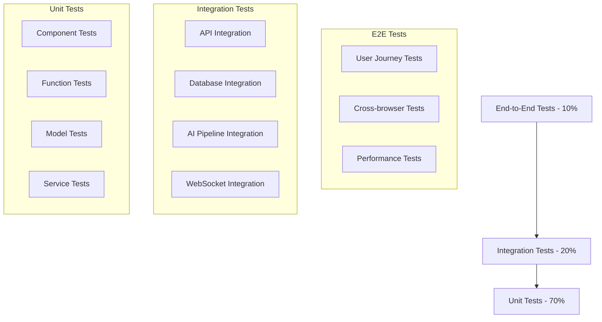

# Cliper - Testing and Debugging Strategy

## 1. Overview

This document outlines comprehensive testing and debugging strategies for the Cliper video analysis application. The strategy ensures high-quality code delivery through systematic testing approaches, robust debugging procedures, and continuous quality assurance processes.

## 2. Testing Strategy Framework

### 2.1 Testing Pyramid Implementation



### 2.2 Testing Coverage Goals

| Test Type | Coverage Target | Tools | Frequency |
|-----------|----------------|-------|----------|
| Unit Tests | 90%+ | Jest, pytest | Every commit |
| Integration Tests | 80%+ | Cypress, pytest | Every PR |
| E2E Tests | Critical paths | Playwright, Cypress | Daily/Release |
| Performance Tests | Key scenarios | K6, Lighthouse | Weekly |
| Security Tests | All endpoints | OWASP ZAP, Bandit | Weekly |

## 3. Unit Testing Strategy

### 3.1 Frontend Unit Testing

#### React Component Testing
```typescript
// Example: Dashboard component test
import { render, screen, waitFor } from '@testing-library/react';
import { QueryClient, QueryClientProvider } from '@tanstack/react-query';
import { Dashboard } from '../Dashboard';
import { mockJobsData } from '../../__mocks__/jobsData';

describe('Dashboard Component', () => {
  let queryClient: QueryClient;
  
  beforeEach(() => {
    queryClient = new QueryClient({
      defaultOptions: {
        queries: { retry: false },
        mutations: { retry: false },
      },
    });
  });
  
  it('should display job statistics correctly', async () => {
    // Mock API response
    jest.spyOn(global, 'fetch').mockResolvedValueOnce({
      ok: true,
      json: async () => mockJobsData,
    } as Response);
    
    render(
      <QueryClientProvider client={queryClient}>
        <Dashboard />
      </QueryClientProvider>
    );
    
    await waitFor(() => {
      expect(screen.getByText('Total Jobs: 15')).toBeInTheDocument();
      expect(screen.getByText('Completed: 12')).toBeInTheDocument();
      expect(screen.getByText('Processing: 2')).toBeInTheDocument();
    });
  });
  
  it('should handle loading states', () => {
    render(
      <QueryClientProvider client={queryClient}>
        <Dashboard />
      </QueryClientProvider>
    );
    
    expect(screen.getByTestId('loading-spinner')).toBeInTheDocument();
  });
  
  it('should handle error states', async () => {
    jest.spyOn(global, 'fetch').mockRejectedValueOnce(new Error('API Error'));
    
    render(
      <QueryClientProvider client={queryClient}>
        <Dashboard />
      </QueryClientProvider>
    );
    
    await waitFor(() => {
      expect(screen.getByText(/error loading dashboard/i)).toBeInTheDocument();
    });
  });
});
```

#### Custom Hooks Testing
```typescript
// Example: useAuth hook test
import { renderHook, act } from '@testing-library/react';
import { useAuth } from '../useAuth';
import { AuthProvider } from '../../contexts/AuthContext';

describe('useAuth Hook', () => {
  const wrapper = ({ children }: { children: React.ReactNode }) => (
    <AuthProvider>{children}</AuthProvider>
  );
  
  it('should handle login successfully', async () => {
    const { result } = renderHook(() => useAuth(), { wrapper });
    
    await act(async () => {
      await result.current.login('test@example.com', 'password123');
    });
    
    expect(result.current.user).toBeDefined();
    expect(result.current.isAuthenticated).toBe(true);
  });
  
  it('should handle login failure', async () => {
    const { result } = renderHook(() => useAuth(), { wrapper });
    
    await act(async () => {
      try {
        await result.current.login('invalid@example.com', 'wrongpassword');
      } catch (error) {
        expect(error.message).toContain('Invalid credentials');
      }
    });
    
    expect(result.current.isAuthenticated).toBe(false);
  });
});
```

### 3.2 Backend Unit Testing

#### API Endpoint Testing
```python
# Example: Job creation endpoint test
import pytest
from fastapi.testclient import TestClient
from unittest.mock import patch, MagicMock
from app.main import app
from app.models.user import User
from app.models.job import Job

client = TestClient(app)

class TestJobEndpoints:
    @pytest.fixture
    def authenticated_user(self):
        return User(
            id="user-123",
            email="test@example.com",
            name="Test User"
        )
    
    @pytest.fixture
    def auth_headers(self, authenticated_user):
        token = create_access_token(data={"sub": authenticated_user.email})
        return {"Authorization": f"Bearer {token}"}
    
    def test_create_job_success(self, auth_headers):
        with patch('app.services.job_service.create_job') as mock_create:
            mock_job = Job(
                id="job-123",
                user_id="user-123",
                status="pending",
                file_path="/uploads/video.mp4"
            )
            mock_create.return_value = mock_job
            
            response = client.post(
                "/api/v1/jobs/create",
                files={"video_file": ("test.mp4", b"fake video data", "video/mp4")},
                headers=auth_headers
            )
            
            assert response.status_code == 201
            data = response.json()
            assert data["job_id"] == "job-123"
            assert data["status"] == "pending"
    
    def test_create_job_invalid_file(self, auth_headers):
        response = client.post(
            "/api/v1/jobs/create",
            files={"video_file": ("test.txt", b"not a video", "text/plain")},
            headers=auth_headers
        )
        
        assert response.status_code == 400
        assert "Invalid file type" in response.json()["detail"]
    
    def test_create_job_unauthorized(self):
        response = client.post(
            "/api/v1/jobs/create",
            files={"video_file": ("test.mp4", b"fake video data", "video/mp4")}
        )
        
        assert response.status_code == 401
```

#### AI Service Testing
```python
# Example: Speech recognition service test
import pytest
from unittest.mock import patch, MagicMock
from app.ai.speech_recognition import SpeechRecognitionService
from app.models.transcript import TranscriptSegment

class TestSpeechRecognitionService:
    @pytest.fixture
    def service(self):
        return SpeechRecognitionService()
    
    @patch('app.ai.speech_recognition.whisper.load_model')
    def test_transcribe_audio_success(self, mock_load_model, service):
        # Mock Whisper model
        mock_model = MagicMock()
        mock_model.transcribe.return_value = {
            "segments": [
                {
                    "start": 0.0,
                    "end": 5.2,
                    "text": "Hello world",
                    "confidence": 0.95
                }
            ],
            "language": "en"
        }
        mock_load_model.return_value = mock_model
        
        result = service.transcribe_audio("test_audio.wav")
        
        assert result.language == "en"
        assert len(result.segments) == 1
        assert result.segments[0].text == "Hello world"
        assert result.segments[0].confidence == 0.95
    
    @patch('app.ai.speech_recognition.whisper.load_model')
    def test_transcribe_audio_fallback(self, mock_load_model, service):
        # Mock Whisper failure
        mock_load_model.side_effect = Exception("Whisper failed")
        
        with patch('app.ai.speech_recognition.google_speech_api') as mock_google:
            mock_google.transcribe.return_value = {
                "segments": [{"start": 0.0, "end": 5.0, "text": "Fallback text"}],
                "language": "en"
            }
            
            result = service.transcribe_audio("test_audio.wav")
            
            assert result.language == "en"
            assert "Fallback text" in result.segments[0].text
    
    def test_transcribe_audio_invalid_file(self, service):
        with pytest.raises(ValueError, match="Invalid audio file"):
            service.transcribe_audio("nonexistent.wav")
```

## 4. Integration Testing Strategy

### 4.1 API Integration Testing

```python
# Example: Complete video processing workflow test
import pytest
import asyncio
from fastapi.testclient import TestClient
from app.main import app
from app.database import get_db
from app.models.job import Job, JobStatus

class TestVideoProcessingWorkflow:
    @pytest.fixture
    def client(self):
        return TestClient(app)
    
    @pytest.fixture
    def sample_video_file(self):
        # Create a small test video file
        return ("sample.mp4", open("tests/fixtures/sample_video.mp4", "rb"), "video/mp4")
    
    @pytest.mark.asyncio
    async def test_complete_video_processing_workflow(self, client, sample_video_file, auth_headers):
        # Step 1: Upload video and create job
        response = client.post(
            "/api/v1/jobs/create",
            files={"video_file": sample_video_file},
            headers=auth_headers
        )
        assert response.status_code == 201
        job_data = response.json()
        job_id = job_data["job_id"]
        
        # Step 2: Wait for processing to start
        await asyncio.sleep(2)
        
        # Step 3: Check job status
        status_response = client.get(
            f"/api/v1/jobs/{job_id}/status",
            headers=auth_headers
        )
        assert status_response.status_code == 200
        status_data = status_response.json()
        assert status_data["status"] in ["processing", "completed"]
        
        # Step 4: Wait for completion (with timeout)
        max_wait = 300  # 5 minutes
        wait_time = 0
        while wait_time < max_wait:
            status_response = client.get(
                f"/api/v1/jobs/{job_id}/status",
                headers=auth_headers
            )
            status_data = status_response.json()
            
            if status_data["status"] == "completed":
                break
            elif status_data["status"] == "failed":
                pytest.fail(f"Job failed: {status_data.get('error_message')}")
            
            await asyncio.sleep(10)
            wait_time += 10
        
        assert status_data["status"] == "completed"
        
        # Step 5: Get analysis results
        analysis_response = client.get(
            f"/api/v1/jobs/{job_id}/analysis",
            headers=auth_headers
        )
        assert analysis_response.status_code == 200
        analysis_data = analysis_response.json()
        
        # Verify analysis results structure
        assert "transcript" in analysis_data
        assert "visual_analysis" in analysis_data
        assert "viral_score" in analysis_data
        assert "recommended_clips" in analysis_data
        
        # Step 6: Generate clips
        clip_request = {
            "clip_segments": analysis_data["recommended_clips"][:2],
            "platform": "tiktok",
            "quality": "high"
        }
        
        clip_response = client.post(
            f"/api/v1/jobs/{job_id}/clips",
            json=clip_request,
            headers=auth_headers
        )
        assert clip_response.status_code == 201
        
        # Step 7: Verify clips are generated
        clips_response = client.get(
            f"/api/v1/jobs/{job_id}/clips",
            headers=auth_headers
        )
        assert clips_response.status_code == 200
        clips_data = clips_response.json()
        assert len(clips_data["clips"]) >= 1
```

### 4.2 Database Integration Testing

```python
# Example: Database relationship and constraint testing
import pytest
from sqlalchemy.exc import IntegrityError
from app.database import SessionLocal
from app.models.user import User
from app.models.job import Job
from app.models.job_result import JobResult

class TestDatabaseIntegration:
    @pytest.fixture
    def db_session(self):
        session = SessionLocal()
        try:
            yield session
        finally:
            session.rollback()
            session.close()
    
    def test_user_job_relationship(self, db_session):
        # Create user
        user = User(
            email="test@example.com",
            password_hash="hashed_password",
            name="Test User"
        )
        db_session.add(user)
        db_session.commit()
        
        # Create job for user
        job = Job(
            user_id=user.id,
            status="pending",
            file_path="/uploads/test.mp4"
        )
        db_session.add(job)
        db_session.commit()
        
        # Verify relationship
        assert job.user.email == "test@example.com"
        assert len(user.jobs) == 1
        assert user.jobs[0].id == job.id
    
    def test_cascade_delete(self, db_session):
        # Create user with job
        user = User(
            email="test@example.com",
            password_hash="hashed_password",
            name="Test User"
        )
        db_session.add(user)
        db_session.commit()
        
        job = Job(
            user_id=user.id,
            status="completed",
            file_path="/uploads/test.mp4"
        )
        db_session.add(job)
        db_session.commit()
        
        job_result = JobResult(
            job_id=job.id,
            overall_viral_score=8.5
        )
        db_session.add(job_result)
        db_session.commit()
        
        # Delete user should cascade to jobs and results
        db_session.delete(user)
        db_session.commit()
        
        # Verify cascade deletion
        assert db_session.query(Job).filter_by(id=job.id).first() is None
        assert db_session.query(JobResult).filter_by(id=job_result.id).first() is None
    
    def test_unique_constraints(self, db_session):
        # Test email uniqueness
        user1 = User(
            email="test@example.com",
            password_hash="hash1",
            name="User 1"
        )
        user2 = User(
            email="test@example.com",
            password_hash="hash2",
            name="User 2"
        )
        
        db_session.add(user1)
        db_session.commit()
        
        db_session.add(user2)
        with pytest.raises(IntegrityError):
            db_session.commit()
```

## 5. End-to-End Testing Strategy

### 5.1 User Journey Testing

```typescript
// Example: Complete user journey E2E test
import { test, expect } from '@playwright/test';

test.describe('Video Processing User Journey', () => {
  test('complete video upload and analysis workflow', async ({ page }) => {
    // Step 1: Navigate to application
    await page.goto('/');
    
    // Step 2: Login
    await page.click('[data-testid="login-button"]');
    await page.fill('[data-testid="email-input"]', 'test@example.com');
    await page.fill('[data-testid="password-input"]', 'password123');
    await page.click('[data-testid="submit-login"]');
    
    // Verify login success
    await expect(page.locator('[data-testid="user-menu"]')).toBeVisible();
    
    // Step 3: Upload video
    await page.click('[data-testid="upload-button"]');
    
    // Upload file
    const fileInput = page.locator('input[type="file"]');
    await fileInput.setInputFiles('tests/fixtures/sample_video.mp4');
    
    // Start processing
    await page.click('[data-testid="start-processing"]');
    
    // Step 4: Monitor processing
    await expect(page.locator('[data-testid="processing-status"]')).toContainText('Processing');
    
    // Wait for completion (with timeout)
    await page.waitForSelector('[data-testid="processing-complete"]', {
      timeout: 300000 // 5 minutes
    });
    
    // Step 5: View results
    await page.click('[data-testid="view-results"]');
    
    // Verify results page elements
    await expect(page.locator('[data-testid="viral-score"]')).toBeVisible();
    await expect(page.locator('[data-testid="transcript-section"]')).toBeVisible();
    await expect(page.locator('[data-testid="recommended-clips"]')).toBeVisible();
    
    // Step 6: Generate clips
    await page.click('[data-testid="generate-clips-button"]');
    
    // Select platform
    await page.selectOption('[data-testid="platform-select"]', 'tiktok');
    
    // Confirm generation
    await page.click('[data-testid="confirm-generation"]');
    
    // Wait for clip generation
    await page.waitForSelector('[data-testid="clips-ready"]', {
      timeout: 120000 // 2 minutes
    });
    
    // Step 7: Download clips
    const downloadPromise = page.waitForEvent('download');
    await page.click('[data-testid="download-clip-0"]');
    const download = await downloadPromise;
    
    // Verify download
    expect(download.suggestedFilename()).toMatch(/.*\.mp4$/);
    
    // Step 8: Check history
    await page.click('[data-testid="history-link"]');
    
    // Verify job appears in history
    await expect(page.locator('[data-testid="job-history-item"]').first()).toBeVisible();
    await expect(page.locator('[data-testid="job-status"]').first()).toContainText('Completed');
  });
  
  test('error handling for invalid file upload', async ({ page }) => {
    await page.goto('/');
    
    // Login
    await page.click('[data-testid="login-button"]');
    await page.fill('[data-testid="email-input"]', 'test@example.com');
    await page.fill('[data-testid="password-input"]', 'password123');
    await page.click('[data-testid="submit-login"]');
    
    // Try to upload invalid file
    await page.click('[data-testid="upload-button"]');
    const fileInput = page.locator('input[type="file"]');
    await fileInput.setInputFiles('tests/fixtures/invalid_file.txt');
    
    // Verify error message
    await expect(page.locator('[data-testid="error-message"]')).toContainText('Invalid file type');
    
    // Verify upload button is disabled
    await expect(page.locator('[data-testid="start-processing"]')).toBeDisabled();
  });
});
```

### 5.2 Performance Testing

```javascript
// Example: K6 performance test
import http from 'k6/http';
import { check, sleep } from 'k6';
import { Rate } from 'k6/metrics';

const errorRate = new Rate('errors');

export const options = {
  stages: [
    { duration: '2m', target: 10 }, // Ramp up
    { duration: '5m', target: 50 }, // Stay at 50 users
    { duration: '2m', target: 100 }, // Ramp up to 100 users
    { duration: '5m', target: 100 }, // Stay at 100 users
    { duration: '2m', target: 0 }, // Ramp down
  ],
  thresholds: {
    http_req_duration: ['p(95)<500'], // 95% of requests under 500ms
    errors: ['rate<0.1'], // Error rate under 10%
  },
};

const BASE_URL = 'http://localhost:8000';

export function setup() {
  // Login and get auth token
  const loginResponse = http.post(`${BASE_URL}/api/v1/auth/login`, {
    email: 'test@example.com',
    password: 'password123',
  });
  
  return {
    authToken: loginResponse.json('access_token'),
  };
}

export default function (data) {
  const headers = {
    'Authorization': `Bearer ${data.authToken}`,
    'Content-Type': 'application/json',
  };
  
  // Test dashboard endpoint
  const dashboardResponse = http.get(`${BASE_URL}/api/v1/dashboard`, {
    headers,
  });
  
  check(dashboardResponse, {
    'dashboard status is 200': (r) => r.status === 200,
    'dashboard response time < 200ms': (r) => r.timings.duration < 200,
  }) || errorRate.add(1);
  
  // Test job status endpoint
  const jobsResponse = http.get(`${BASE_URL}/api/v1/jobs`, {
    headers,
  });
  
  check(jobsResponse, {
    'jobs status is 200': (r) => r.status === 200,
    'jobs response time < 300ms': (r) => r.timings.duration < 300,
  }) || errorRate.add(1);
  
  sleep(1);
}

export function teardown(data) {
  // Cleanup if needed
}
```

## 6. Debugging Strategy

### 6.1 Development Debugging

#### Frontend Debugging Setup
```typescript
// Debug utility for React components
export const debugComponent = (componentName: string, props: any, state?: any) => {
  if (process.env.NODE_ENV === 'development') {
    console.group(`🔍 Debug: ${componentName}`);
    console.log('Props:', props);
    if (state) console.log('State:', state);
    console.log('Timestamp:', new Date().toISOString());
    console.groupEnd();
  }
};

// Error boundary with detailed logging
export class ErrorBoundary extends React.Component<
  { children: React.ReactNode },
  { hasError: boolean; error?: Error }
> {
  constructor(props: { children: React.ReactNode }) {
    super(props);
    this.state = { hasError: false };
  }
  
  static getDerivedStateFromError(error: Error) {
    return { hasError: true, error };
  }
  
  componentDidCatch(error: Error, errorInfo: React.ErrorInfo) {
    console.error('Error Boundary caught an error:', error, errorInfo);
    
    // Send to error tracking service
    if (process.env.NODE_ENV === 'production') {
      // Sentry.captureException(error, { extra: errorInfo });
    }
  }
  
  render() {
    if (this.state.hasError) {
      return (
        <div className="error-fallback">
          <h2>Something went wrong.</h2>
          {process.env.NODE_ENV === 'development' && (
            <details>
              <summary>Error details</summary>
              <pre>{this.state.error?.stack}</pre>
            </details>
          )}
        </div>
      );
    }
    
    return this.props.children;
  }
}
```

#### Backend Debugging Setup
```python
# Enhanced logging configuration
import logging
import sys
from typing import Any, Dict
import json
from datetime import datetime

class StructuredFormatter(logging.Formatter):
    def format(self, record: logging.LogRecord) -> str:
        log_entry = {
            "timestamp": datetime.utcnow().isoformat(),
            "level": record.levelname,
            "logger": record.name,
            "message": record.getMessage(),
            "module": record.module,
            "function": record.funcName,
            "line": record.lineno,
        }
        
        # Add extra fields if present
        if hasattr(record, 'user_id'):
            log_entry['user_id'] = record.user_id
        if hasattr(record, 'job_id'):
            log_entry['job_id'] = record.job_id
        if hasattr(record, 'correlation_id'):
            log_entry['correlation_id'] = record.correlation_id
            
        return json.dumps(log_entry)

def setup_logging():
    logger = logging.getLogger()
    logger.setLevel(logging.INFO)
    
    handler = logging.StreamHandler(sys.stdout)
    handler.setFormatter(StructuredFormatter())
    logger.addHandler(handler)
    
    return logger

# Debug decorator for functions
def debug_function(func):
    def wrapper(*args, **kwargs):
        logger = logging.getLogger(func.__module__)
        
        # Log function entry
        logger.debug(
            f"Entering {func.__name__}",
            extra={
                "function": func.__name__,
                "args": str(args)[:200],  # Truncate long args
                "kwargs": str(kwargs)[:200]
            }
        )
        
        try:
            result = func(*args, **kwargs)
            
            # Log successful exit
            logger.debug(
                f"Exiting {func.__name__} successfully",
                extra={"function": func.__name__}
            )
            
            return result
            
        except Exception as e:
            # Log exception
            logger.error(
                f"Exception in {func.__name__}: {str(e)}",
                extra={
                    "function": func.__name__,
                    "exception_type": type(e).__name__,
                    "exception_message": str(e)
                },
                exc_info=True
            )
            raise
    
    return wrapper
```

### 6.2 Production Debugging

#### Health Check System
```python
# Comprehensive health check implementation
from fastapi import APIRouter, HTTPException
from typing import Dict, Any
import asyncio
import time
from app.database import get_db
from app.cache import redis_client
from app.ai.services import whisper_service

router = APIRouter()

class HealthChecker:
    def __init__(self):
        self.checks = {
            "database": self._check_database,
            "redis": self._check_redis,
            "ai_services": self._check_ai_services,
            "disk_space": self._check_disk_space,
            "memory": self._check_memory,
        }
    
    async def _check_database(self) -> Dict[str, Any]:
        try:
            start_time = time.time()
            db = next(get_db())
            db.execute("SELECT 1")
            response_time = time.time() - start_time
            
            return {
                "status": "healthy",
                "response_time_ms": round(response_time * 1000, 2)
            }
        except Exception as e:
            return {
                "status": "unhealthy",
                "error": str(e)
            }
    
    async def _check_redis(self) -> Dict[str, Any]:
        try:
            start_time = time.time()
            await redis_client.ping()
            response_time = time.time() - start_time
            
            return {
                "status": "healthy",
                "response_time_ms": round(response_time * 1000, 2)
            }
        except Exception as e:
            return {
                "status": "unhealthy",
                "error": str(e)
            }
    
    async def _check_ai_services(self) -> Dict[str, Any]:
        try:
            # Quick health check for AI services
            whisper_status = whisper_service.health_check()
            
            return {
                "status": "healthy" if whisper_status else "degraded",
                "whisper_available": whisper_status
            }
        except Exception as e:
            return {
                "status": "unhealthy",
                "error": str(e)
            }
    
    async def run_all_checks(self) -> Dict[str, Any]:
        results = {}
        overall_status = "healthy"
        
        for check_name, check_func in self.checks.items():
            try:
                result = await check_func()
                results[check_name] = result
                
                if result["status"] != "healthy":
                    overall_status = "degraded"
                    
            except Exception as e:
                results[check_name] = {
                    "status": "unhealthy",
                    "error": str(e)
                }
                overall_status = "unhealthy"
        
        return {
            "status": overall_status,
            "timestamp": time.time(),
            "checks": results
        }

health_checker = HealthChecker()

@router.get("/health")
async def health_check():
    results = await health_checker.run_all_checks()
    
    if results["status"] == "unhealthy":
        raise HTTPException(status_code=503, detail=results)
    
    return results
```

### 6.3 Error Tracking and Monitoring

#### Sentry Integration
```python
# Sentry configuration for error tracking
import sentry_sdk
from sentry_sdk.integrations.fastapi import FastApiIntegration
from sentry_sdk.integrations.sqlalchemy import SqlalchemyIntegration
from sentry_sdk.integrations.redis import RedisIntegration

def setup_sentry(dsn: str, environment: str):
    sentry_sdk.init(
        dsn=dsn,
        environment=environment,
        integrations=[
            FastApiIntegration(auto_enabling_integrations=False),
            SqlalchemyIntegration(),
            RedisIntegration(),
        ],
        traces_sample_rate=0.1,  # 10% of transactions
        profiles_sample_rate=0.1,  # 10% of transactions for profiling
        before_send=filter_sensitive_data,
    )

def filter_sensitive_data(event, hint):
    # Remove sensitive data from error reports
    if 'request' in event:
        if 'data' in event['request']:
            # Remove password fields
            if isinstance(event['request']['data'], dict):
                event['request']['data'].pop('password', None)
                event['request']['data'].pop('password_hash', None)
    
    return event

# Custom error context
def add_error_context(user_id: str = None, job_id: str = None, **kwargs):
    with sentry_sdk.configure_scope() as scope:
        if user_id:
            scope.set_user({"id": user_id})
        if job_id:
            scope.set_tag("job_id", job_id)
        
        for key, value in kwargs.items():
            scope.set_extra(key, value)
```

## 7. Quality Assurance Processes

### 7.1 Code Review Checklist

#### Backend Code Review
- [ ] **Security**: Input validation, SQL injection prevention, authentication checks
- [ ] **Performance**: Database query optimization, caching implementation
- [ ] **Error Handling**: Proper exception handling and logging
- [ ] **Testing**: Unit tests cover new functionality
- [ ] **Documentation**: API endpoints documented, complex logic explained
- [ ] **Code Style**: Follows PEP 8, proper type hints
- [ ] **Dependencies**: New dependencies justified and secure

#### Frontend Code Review
- [ ] **Accessibility**: ARIA labels, keyboard navigation, screen reader support
- [ ] **Performance**: Lazy loading, memoization, bundle size impact
- [ ] **User Experience**: Loading states, error handling, responsive design
- [ ] **Testing**: Component tests, user interaction tests
- [ ] **Security**: XSS prevention, secure data handling
- [ ] **Code Style**: Follows ESLint rules, proper TypeScript usage
- [ ] **Browser Compatibility**: Cross-browser testing completed

### 7.2 Automated Quality Gates

```yaml
# GitHub Actions workflow for quality gates
name: Quality Gates

on:
  pull_request:
    branches: [main, develop]

jobs:
  code-quality:
    runs-on: ubuntu-latest
    steps:
      - uses: actions/checkout@v3
      
      - name: Setup Python
        uses: actions/setup-python@v4
        with:
          python-version: '3.11'
      
      - name: Install dependencies
        run: |
          pip install -r requirements.txt
          pip install -r requirements-dev.txt
      
      - name: Run linting
        run: |
          flake8 app/
          pylint app/
          black --check app/
      
      - name: Run security scan
        run: |
          bandit -r app/
          safety check
      
      - name: Run unit tests
        run: |
          pytest tests/unit/ --cov=app --cov-report=xml
      
      - name: Check coverage threshold
        run: |
          coverage report --fail-under=90
      
      - name: Upload coverage to Codecov
        uses: codecov/codecov-action@v3
        with:
          file: ./coverage.xml
  
  frontend-quality:
    runs-on: ubuntu-latest
    steps:
      - uses: actions/checkout@v3
      
      - name: Setup Node.js
        uses: actions/setup-node@v3
        with:
          node-version: '18'
          cache: 'npm'
      
      - name: Install dependencies
        run: npm ci
      
      - name: Run linting
        run: |
          npm run lint
          npm run type-check
      
      - name: Run unit tests
        run: npm run test:coverage
      
      - name: Check bundle size
        run: npm run build:analyze
      
      - name: Run accessibility tests
        run: npm run test:a11y
```

### 7.3 Performance Monitoring

```python
# Performance monitoring middleware
import time
import psutil
from fastapi import Request, Response
from starlette.middleware.base import BaseHTTPMiddleware
import logging

class PerformanceMonitoringMiddleware(BaseHTTPMiddleware):
    def __init__(self, app, slow_request_threshold: float = 1.0):
        super().__init__(app)
        self.slow_request_threshold = slow_request_threshold
        self.logger = logging.getLogger(__name__)
    
    async def dispatch(self, request: Request, call_next):
        start_time = time.time()
        start_memory = psutil.Process().memory_info().rss
        
        # Process request
        response = await call_next(request)
        
        # Calculate metrics
        process_time = time.time() - start_time
        end_memory = psutil.Process().memory_info().rss
        memory_delta = end_memory - start_memory
        
        # Log performance metrics
        self.logger.info(
            "Request processed",
            extra={
                "method": request.method,
                "url": str(request.url),
                "status_code": response.status_code,
                "process_time": round(process_time, 3),
                "memory_delta_mb": round(memory_delta / 1024 / 1024, 2),
                "is_slow": process_time > self.slow_request_threshold
            }
        )
        
        # Add performance headers
        response.headers["X-Process-Time"] = str(round(process_time, 3))
        
        # Alert on slow requests
        if process_time > self.slow_request_threshold:
            self.logger.warning(
                f"Slow request detected: {request.method} {request.url} took {process_time:.3f}s"
            )
        
        return response
```

## 8. Continuous Improvement

### 8.1 Testing Metrics Dashboard

```python
# Testing metrics collection
class TestMetricsCollector:
    def __init__(self):
        self.metrics = {
            "test_execution_time": [],
            "test_success_rate": [],
            "code_coverage": [],
            "bug_detection_rate": [],
        }
    
    def collect_test_run_metrics(self, test_results):
        # Collect and analyze test metrics
        total_tests = test_results.get('total', 0)
        passed_tests = test_results.get('passed', 0)
        execution_time = test_results.get('duration', 0)
        coverage = test_results.get('coverage', 0)
        
        success_rate = (passed_tests / total_tests) * 100 if total_tests > 0 else 0
        
        self.metrics['test_execution_time'].append(execution_time)
        self.metrics['test_success_rate'].append(success_rate)
        self.metrics['code_coverage'].append(coverage)
        
        # Generate report
        return {
            "timestamp": time.time(),
            "total_tests": total_tests,
            "success_rate": success_rate,
            "execution_time": execution_time,
            "coverage": coverage,
            "trend_analysis": self._analyze_trends()
        }
    
    def _analyze_trends(self):
        # Analyze trends in testing metrics
        recent_success_rates = self.metrics['test_success_rate'][-10:]
        recent_coverage = self.metrics['code_coverage'][-10:]
        
        return {
            "success_rate_trend": "improving" if len(recent_success_rates) > 1 and recent_success_rates[-1] > recent_success_rates[0] else "stable",
            "coverage_trend": "improving" if len(recent_coverage) > 1 and recent_coverage[-1] > recent_coverage[0] else "stable"
        }
```

### 8.2 Automated Test Generation

```python
# AI-assisted test case generation
class TestCaseGenerator:
    def __init__(self, ai_service):
        self.ai_service = ai_service
    
    def generate_edge_case_tests(self, function_signature, existing_tests):
        prompt = f"""
        Generate edge case test scenarios for the following function:
        
        Function: {function_signature}
        
        Existing tests cover:
        {existing_tests}
        
        Generate 5 additional edge case test scenarios that are not covered:
        """
        
        response = self.ai_service.generate_text(prompt)
        return self._parse_test_scenarios(response)
    
    def _parse_test_scenarios(self, ai_response):
        # Parse AI response into structured test scenarios
        scenarios = []
        lines = ai_response.split('\n')
        
        for line in lines:
            if line.strip().startswith('-') or line.strip().startswith('*'):
                scenario = line.strip().lstrip('-*').strip()
                scenarios.append(scenario)
        
        return scenarios
```

This comprehensive testing and debugging strategy ensures high-quality code delivery through systematic testing approaches, robust debugging procedures, and continuous quality assurance processes. The strategy covers all aspects from unit testing to production monitoring, providing a solid foundation for maintaining code quality throughout the development lifecycle.