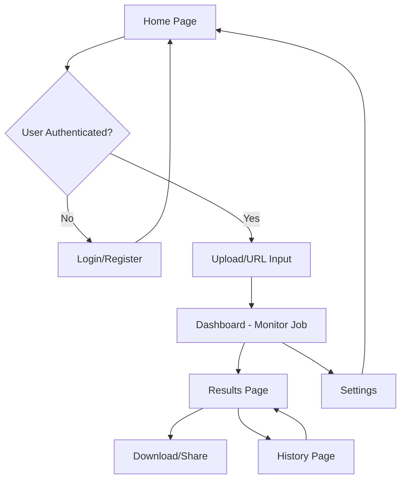

# Video Analysis Application - Product Requirements Document

## 1. Product Overview

A comprehensive video analysis platform that enables users to upload videos or process URLs to generate viral-worthy clips using AI-powered content analysis and automated editing.

The platform solves the problem of manual video editing for content creators by automatically identifying engaging moments, generating clips, and providing analytics to maximize viral potential across social media platforms.

Target market: Content creators, social media managers, and digital marketers seeking to optimize video content for maximum engagement and reach.

## 2. Core Features

### 2.1 User Roles

| Role | Registration Method | Core Permissions |
|------|---------------------|------------------|
| Free User | Email registration via Supabase | Upload videos up to 100MB, process 5 videos/month, basic analytics |
| Premium User | Subscription upgrade | Upload videos up to 500MB, unlimited processing, advanced analytics, priority processing |
| Admin | Internal invitation | Full system access, user management, system monitoring |

### 2.2 Feature Module

Our video analysis application consists of the following main pages:

1. **Home Page**: Hero section with value proposition, file upload interface, URL input for video processing, recent activity overview
2. **Dashboard**: Real-time job monitoring, processing queue status, user analytics and metrics, quick action buttons
3. **History**: Complete processing history with filtering, job details and results viewing, download management, search functionality
4. **Settings**: User profile management, processing preferences, notification settings, subscription management
5. **Results**: Detailed analysis results, generated clips viewer, download options, sharing capabilities
6. **Authentication**: Login and registration pages with Supabase integration

### 2.3 Page Details

| Page Name | Module Name | Feature Description |
|-----------|-------------|---------------------|
| Home Page | Hero Section | Display value proposition, key features, and call-to-action buttons |
| Home Page | File Upload | Drag-and-drop interface, file validation, progress tracking, retry mechanism |
| Home Page | URL Input | Video URL validation, platform detection, processing initiation |
| Home Page | Recent Activity | Show last 3 processed jobs with status and quick access |
| Dashboard | Job Monitor | Real-time status updates, progress bars, estimated completion times |
| Dashboard | Analytics | Processing statistics, success rates, usage metrics, performance charts |
| Dashboard | Quick Actions | Start new job, view recent results, access settings |
| Dashboard | Notifications | System alerts, job completion notices, error notifications |
| History | Job List | Paginated list of all processed jobs with status indicators |
| History | Filtering | Filter by date range, status, job type, file format |
| History | Search | Search by filename, URL, or job ID |
| History | Job Details | View processing parameters, results summary, error logs |
| Settings | Profile | Update user information, change password, account preferences |
| Settings | Processing | Default video quality, clip duration, analysis sensitivity |
| Settings | Notifications | Email preferences, real-time alerts, completion notifications |
| Settings | Subscription | Plan details, usage limits, billing information, upgrade options |
| Results | Clip Viewer | Video player with generated clips, timeline navigation |
| Results | Analysis Data | Engagement scores, viral potential metrics, content insights |
| Results | Download | Bulk download options, format selection, quality settings |
| Results | Sharing | Direct links, social media integration, embed codes |
| Authentication | Login | Email/password login, social login options, remember me |
| Authentication | Registration | Account creation, email verification, terms acceptance |
| Authentication | Password Reset | Email-based password recovery, secure token validation |

## 3. Core Process

### User Flow - Video Processing

1. **Authentication**: User logs in or registers for an account
2. **Job Creation**: User uploads video file or provides URL on home page
3. **Processing**: System validates input, queues job, begins analysis
4. **Monitoring**: User tracks progress on dashboard with real-time updates
5. **Results**: Upon completion, user views generated clips and analysis
6. **Download/Share**: User downloads clips or shares results
7. **History**: All jobs are saved in user's processing history

### Admin Flow

1. **System Monitoring**: Admin monitors overall system health and performance
2. **User Management**: Admin can view user accounts, usage statistics, and manage subscriptions
3. **Job Management**: Admin can view all jobs, troubleshoot issues, and manage processing queue
4. **Analytics**: Admin accesses system-wide analytics and performance metrics

## 4. User Interface Design

### 4.1 Design Style

- **Primary Colors**: Deep blue (#1e40af) for trust and professionalism, bright green (#10b981) for success states
- **Secondary Colors**: Light gray (#f8fafc) for backgrounds, dark gray (#374151) for text
- **Button Style**: Rounded corners (8px), gradient backgrounds, hover animations, 3D shadow effects
- **Font**: Inter font family, 16px base size, 14px for secondary text, 24px+ for headings
- **Layout Style**: Card-based design with subtle shadows, top navigation with sidebar, responsive grid system
- **Icons**: Heroicons for consistency, outlined style for secondary actions, filled for primary actions

### 4.2 Page Design Overview

| Page Name | Module Name | UI Elements |
|-----------|-------------|-------------|
| Home Page | Hero Section | Large heading with gradient text, animated background, CTA buttons with hover effects |
| Home Page | Upload Area | Dashed border drag zone, file icon animations, progress circles, success/error states |
| Dashboard | Job Monitor | Status cards with color coding, progress bars with animations, real-time counters |
| Dashboard | Analytics | Chart.js integration, metric cards with icons, trend indicators with colors |
| History | Job List | Table with alternating row colors, status badges, action buttons, pagination controls |
| Results | Clip Viewer | Custom video player, thumbnail grid, timeline scrubber, fullscreen mode |
| Settings | Form Sections | Grouped form fields, toggle switches, dropdown selectors, save confirmation |
| Authentication | Login Form | Centered card layout, input validation states, social login buttons, loading spinners |

### 4.3 Responsiveness

Desktop-first approach with mobile-adaptive breakpoints at 768px and 1024px. Touch interaction optimization for mobile devices including larger tap targets, swipe gestures for navigation, and optimized video player controls for touch screens.

**Breakpoint Strategy**:
- Desktop (1024px+): Full sidebar navigation, multi-column layouts, hover interactions
- Tablet (768px-1023px): Collapsible sidebar, two-column layouts, touch-friendly controls
- Mobile (<768px): Bottom navigation, single-column layouts, gesture-based interactions