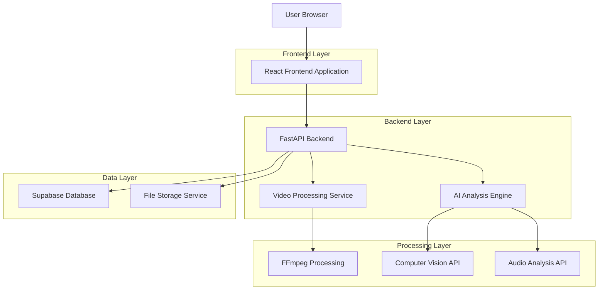
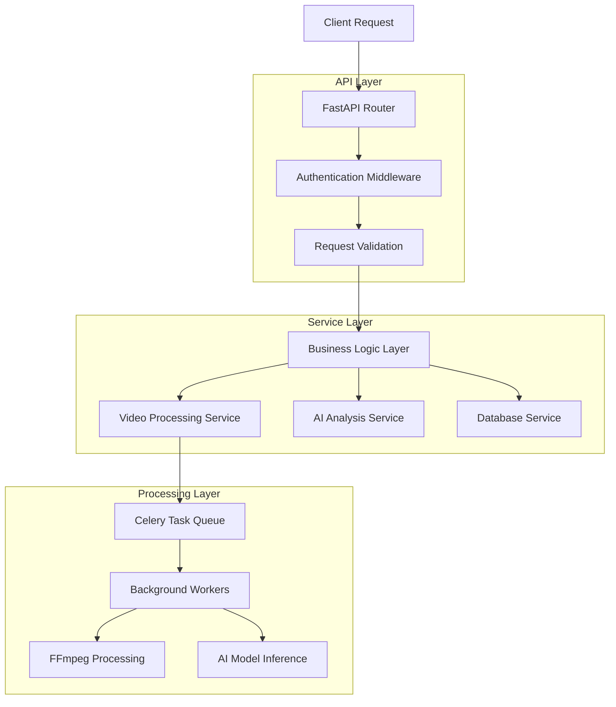
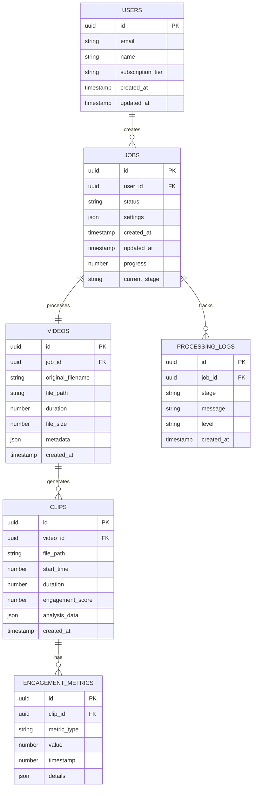

# Video Clipper - Technical Architecture Document

## 1. Architecture Design



## 2. Technology Description
- Frontend: React@18 + TypeScript + TailwindCSS + Vite
- Backend: FastAPI + Python 3.11 + Celery + Redis
- Database: Supabase (PostgreSQL)
- File Storage: Supabase Storage
- Video Processing: FFmpeg + OpenCV + MoviePy
- AI/ML: OpenAI API + Whisper + Computer Vision libraries

## 3. Route Definitions
| Route | Purpose |
|-------|---------|
| / | Home page with upload interface and feature overview |
| /upload | Video upload page with drag-and-drop and URL input |
| /dashboard/:jobId | Real-time analysis dashboard showing processing status |
| /results/:jobId | Results page displaying generated clips and download options |
| /settings | User preferences and output configuration settings |
| /history | User's processing history and previous results |
| /admin | Admin panel for system monitoring and user management |

## 4. API Definitions

### 4.1 Core API

**Video Upload**
```
POST /api/videos/upload
```

Request:
| Param Name | Param Type | isRequired | Description |
|------------|------------|------------|-------------|
| file | File | true | Video file (MP4, MOV, AVI) up to 2GB |
| settings | object | false | Processing preferences and output settings |

Response:
| Param Name | Param Type | Description |
|------------|------------|-------------|
| jobId | string | Unique identifier for the processing job |
| status | string | Initial status ("queued", "processing", "completed") |
| estimatedTime | number | Estimated processing time in minutes |

Example:
```json
{
  "jobId": "job_123456",
  "status": "queued",
  "estimatedTime": 15
}
```

**URL Processing**
```
POST /api/videos/process-url
```

Request:
| Param Name | Param Type | isRequired | Description |
|------------|------------|------------|-------------|
| url | string | true | Video URL (YouTube, Vimeo, direct links) |
| settings | object | false | Processing preferences |

Response:
| Param Name | Param Type | Description |
|------------|------------|-------------|
| jobId | string | Processing job identifier |
| status | string | Job status |
| downloadProgress | number | URL download progress percentage |

**Job Status**
```
GET /api/jobs/{jobId}/status
```

Response:
| Param Name | Param Type | Description |
|------------|------------|-------------|
| status | string | Current processing status |
| progress | number | Completion percentage (0-100) |
| currentStage | string | Current processing stage description |
| clips | array | Generated clips information |

**Results Retrieval**
```
GET /api/jobs/{jobId}/results
```

Response:
| Param Name | Param Type | Description |
|------------|------------|-------------|
| clips | array | Array of generated clip objects |
| originalVideo | object | Original video metadata |
| processingStats | object | Analysis statistics and metrics |

## 5. Server Architecture Diagram



## 6. Data Model

### 6.1 Data Model Definition



### 6.2 Data Definition Language

**Users Table**
```sql
CREATE TABLE users (
    id UUID PRIMARY KEY DEFAULT gen_random_uuid(),
    email VARCHAR(255) UNIQUE NOT NULL,
    name VARCHAR(100) NOT NULL,
    subscription_tier VARCHAR(20) DEFAULT 'free' CHECK (subscription_tier IN ('free', 'pro', 'enterprise')),
    created_at TIMESTAMP WITH TIME ZONE DEFAULT NOW(),
    updated_at TIMESTAMP WITH TIME ZONE DEFAULT NOW()
);

CREATE INDEX idx_users_email ON users(email);
```

**Jobs Table**
```sql
CREATE TABLE jobs (
    id UUID PRIMARY KEY DEFAULT gen_random_uuid(),
    user_id UUID REFERENCES users(id) ON DELETE CASCADE,
    status VARCHAR(20) DEFAULT 'queued' CHECK (status IN ('queued', 'processing', 'completed', 'failed')),
    settings JSONB DEFAULT '{}',
    progress INTEGER DEFAULT 0 CHECK (progress >= 0 AND progress <= 100),
    current_stage VARCHAR(100),
    created_at TIMESTAMP WITH TIME ZONE DEFAULT NOW(),
    updated_at TIMESTAMP WITH TIME ZONE DEFAULT NOW()
);

CREATE INDEX idx_jobs_user_id ON jobs(user_id);
CREATE INDEX idx_jobs_status ON jobs(status);
CREATE INDEX idx_jobs_created_at ON jobs(created_at DESC);
```

**Videos Table**
```sql
CREATE TABLE videos (
    id UUID PRIMARY KEY DEFAULT gen_random_uuid(),
    job_id UUID REFERENCES jobs(id) ON DELETE CASCADE,
    original_filename VARCHAR(255) NOT NULL,
    file_path VARCHAR(500) NOT NULL,
    duration DECIMAL(10,2),
    file_size BIGINT,
    metadata JSONB DEFAULT '{}',
    created_at TIMESTAMP WITH TIME ZONE DEFAULT NOW()
);

CREATE INDEX idx_videos_job_id ON videos(job_id);
```

**Clips Table**
```sql
CREATE TABLE clips (
    id UUID PRIMARY KEY DEFAULT gen_random_uuid(),
    video_id UUID REFERENCES videos(id) ON DELETE CASCADE,
    file_path VARCHAR(500) NOT NULL,
    start_time DECIMAL(10,2) NOT NULL,
    duration DECIMAL(10,2) NOT NULL,
    engagement_score DECIMAL(5,2) DEFAULT 0,
    analysis_data JSONB DEFAULT '{}',
    created_at TIMESTAMP WITH TIME ZONE DEFAULT NOW()
);

CREATE INDEX idx_clips_video_id ON clips(video_id);
CREATE INDEX idx_clips_engagement_score ON clips(engagement_score DESC);
```

**Engagement Metrics Table**
```sql
CREATE TABLE engagement_metrics (
    id UUID PRIMARY KEY DEFAULT gen_random_uuid(),
    clip_id UUID REFERENCES clips(id) ON DELETE CASCADE,
    metric_type VARCHAR(50) NOT NULL,
    value DECIMAL(10,4) NOT NULL,
    timestamp_offset DECIMAL(10,2) NOT NULL,
    details JSONB DEFAULT '{}',
    created_at TIMESTAMP WITH TIME ZONE DEFAULT NOW()
);

CREATE INDEX idx_engagement_metrics_clip_id ON engagement_metrics(clip_id);
CREATE INDEX idx_engagement_metrics_type ON engagement_metrics(metric_type);
```

**Processing Logs Table**
```sql
CREATE TABLE processing_logs (
    id UUID PRIMARY KEY DEFAULT gen_random_uuid(),
    job_id UUID REFERENCES jobs(id) ON DELETE CASCADE,
    stage VARCHAR(100) NOT NULL,
    message TEXT NOT NULL,
    level VARCHAR(20) DEFAULT 'info' CHECK (level IN ('debug', 'info', 'warning', 'error')),
    created_at TIMESTAMP WITH TIME ZONE DEFAULT NOW()
);

CREATE INDEX idx_processing_logs_job_id ON processing_logs(job_id);
CREATE INDEX idx_processing_logs_created_at ON processing_logs(created_at DESC);
```

**Initial Data**
```sql
-- Grant permissions to authenticated users
GRANT SELECT, INSERT, UPDATE, DELETE ON users TO authenticated;
GRANT SELECT, INSERT, UPDATE, DELETE ON jobs TO authenticated;
GRANT SELECT, INSERT, UPDATE, DELETE ON videos TO authenticated;
GRANT SELECT, INSERT, UPDATE, DELETE ON clips TO authenticated;
GRANT SELECT, INSERT, UPDATE, DELETE ON engagement_metrics TO authenticated;
GRANT SELECT, INSERT, UPDATE, DELETE ON processing_logs TO authenticated;

-- Grant basic read access to anonymous users for public data
GRANT SELECT ON clips TO anon;
GRANT SELECT ON engagement_metrics TO anon;
```