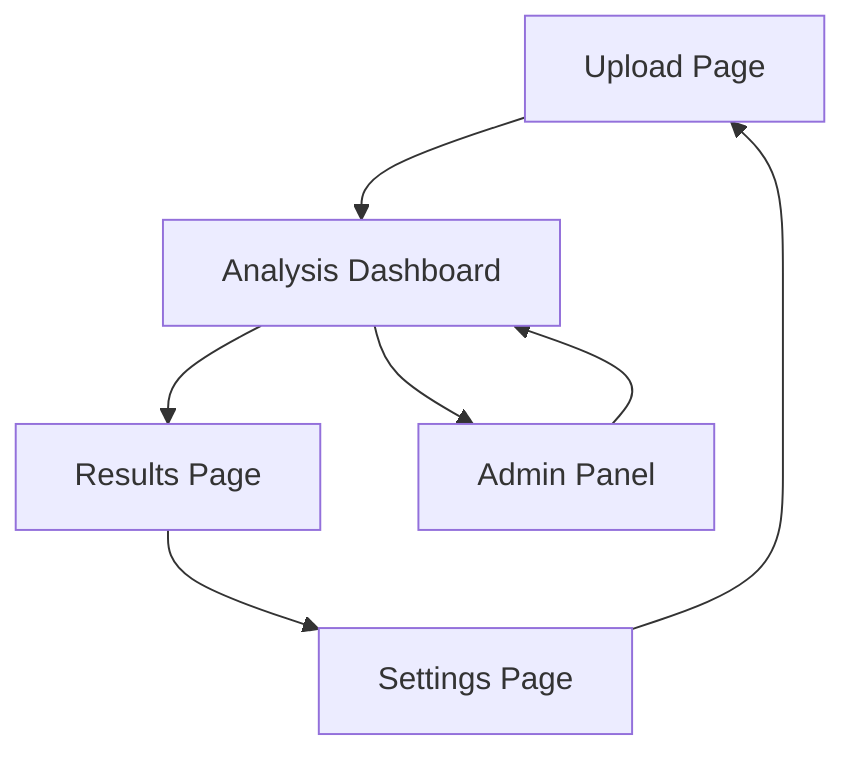

# Video Clipper - Product Requirements Document

## 1. Product Overview
An intelligent video analysis platform that automatically processes lengthy videos to identify the most engaging moments and generates 10 optimized short-form clips suitable for social media distribution.

The system solves the time-consuming manual process of finding viral moments in long-form content, targeting content creators, social media managers, and marketing teams who need to maximize their content reach across platforms.

## 2. Core Features

### 2.1 User Roles
| Role | Registration Method | Core Permissions |
|------|---------------------|------------------|
| Content Creator | Email registration | Upload videos, generate clips, download results |
| Pro User | Subscription upgrade | Batch processing, advanced analytics, priority processing |
| Admin | System invitation | User management, system monitoring, content moderation |

### 2.2 Feature Module
Our video clipper requirements consist of the following main pages:
1. **Upload page**: video file upload, URL input, processing queue display.
2. **Analysis dashboard**: real-time processing status, engagement metrics visualization, clip preview grid.
3. **Results page**: generated clips gallery, download options, social media optimization tools.
4. **Settings page**: output preferences, quality settings, platform-specific formatting.

### 2.3 Page Details
| Page Name | Module Name | Feature description |
|-----------|-------------|---------------------|
| Upload page | File Upload | Support drag-and-drop video files up to 2GB, validate formats (MP4, MOV, AVI) |
| Upload page | URL Input | Accept YouTube, Vimeo, and direct video URLs with automatic download |
| Upload page | Processing Queue | Display upload progress, estimated processing time, queue position |
| Analysis dashboard | Real-time Status | Show processing stages: analysis, segment detection, clip generation |
| Analysis dashboard | Engagement Metrics | Visualize detected peaks in audio, visual activity, and content engagement scores |
| Analysis dashboard | Preview Grid | Display thumbnail previews of identified segments with engagement scores |
| Results page | Clips Gallery | Show 10 generated clips with play controls, duration, and engagement ratings |
| Results page | Download Options | Bulk download, individual clip download, format selection (MP4, WebM) |
| Results page | Social Media Tools | Platform-specific optimization (Instagram, TikTok, YouTube Shorts) with captions |
| Settings page | Output Preferences | Configure clip duration (15-60 seconds), resolution, quality settings |
| Settings page | Platform Formatting | Aspect ratio selection (16:9, 9:16, 1:1), auto-cropping preferences |
| Settings page | Advanced Options | Custom engagement thresholds, content filtering, batch processing settings |

## 3. Core Process

### Content Creator Flow
1. User uploads a video file or provides a URL on the upload page
2. System validates the input and adds it to the processing queue
3. User monitors real-time analysis progress on the dashboard
4. AI algorithms analyze the video for engaging moments using audio, visual, and content metrics
5. System generates 10 optimized short clips from the highest-scoring segments
6. User reviews results on the results page and downloads preferred clips
7. User can apply platform-specific optimizations before final download

### Admin Flow
1. Admin monitors system performance and user activity
2. Admin can prioritize processing queues and manage system resources
3. Admin reviews flagged content and manages user accounts

## 4. User Interface Design

### 4.1 Design Style
- **Primary colors**: Deep blue (#1e3a8a) and vibrant orange (#f97316)
- **Secondary colors**: Light gray (#f8fafc) and dark gray (#1f2937)
- **Button style**: Rounded corners with subtle shadows and hover animations
- **Font**: Inter for headings (16-24px), system fonts for body text (14-16px)
- **Layout style**: Card-based design with clean grid layouts and responsive breakpoints
- **Icons**: Outline style icons with consistent 24px sizing, video and media-focused iconography

### 4.2 Page Design Overview
| Page Name | Module Name | UI Elements |
|-----------|-------------|-------------|
| Upload page | File Upload | Large drag-and-drop zone with dashed border, progress bars, file type indicators |
| Upload page | URL Input | Clean input field with validation states, paste button, format detection |
| Analysis dashboard | Status Display | Progress rings, stage indicators, estimated time remaining with animated transitions |
| Analysis dashboard | Metrics Visualization | Interactive charts showing engagement peaks, timeline scrubber, heatmap overlays |
| Results page | Clips Gallery | Grid layout with hover effects, play buttons, engagement score badges |
| Results page | Download Section | Grouped download buttons, format selectors, batch action controls |
| Settings page | Configuration Panels | Tabbed interface, slider controls, toggle switches, preview windows |

### 4.3 Responsiveness
Desktop-first design with mobile-adaptive layouts. Touch-optimized controls for mobile devices, with simplified navigation and gesture-based interactions for video preview and selection.