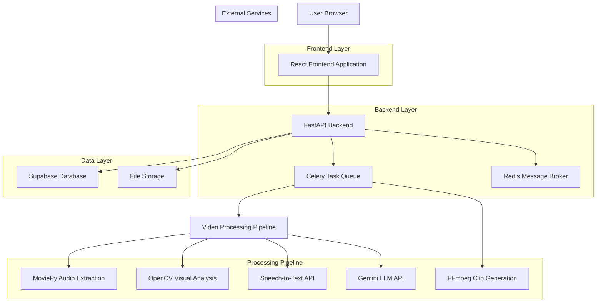
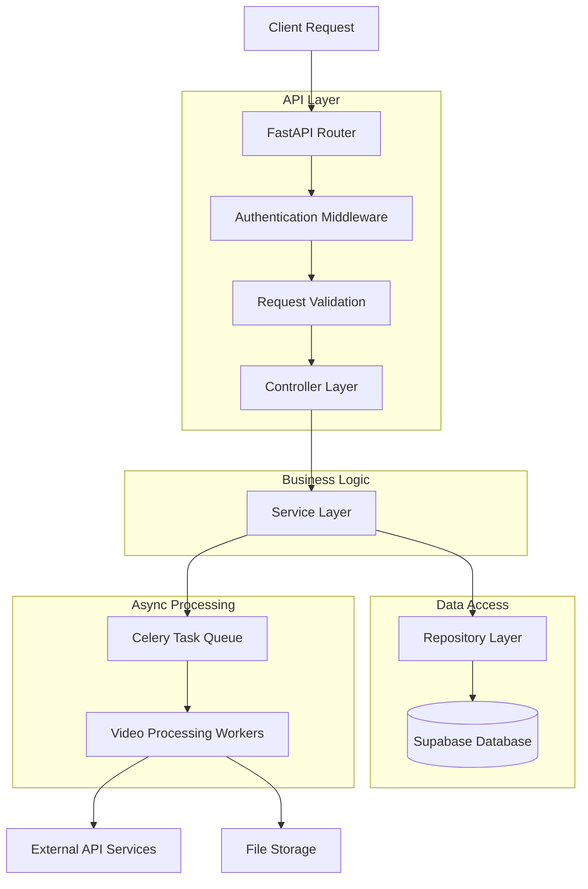
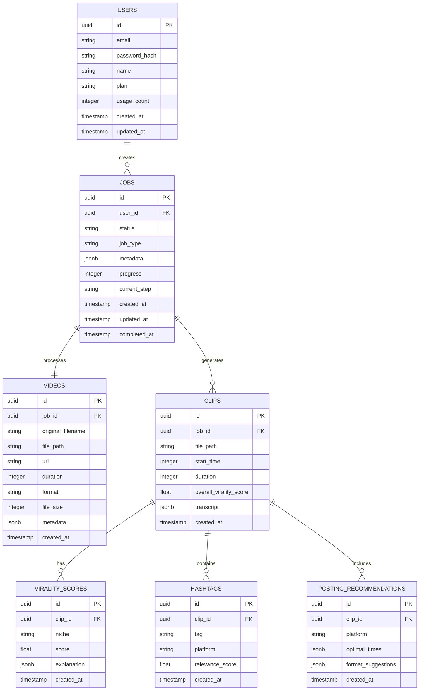

# Virality Clipper - Technical Architecture Document

## 1. Architecture Design



## 2. Technology Description

* **Frontend**: React\@18 + TypeScript + Tailwind CSS\@3 + Vite

* **Backend**: FastAPI + Python\@3.11 + Celery + Redis

* **Database**: Supabase (PostgreSQL)

* **File Storage**: Supabase Storage

* **Video Processing**: MoviePy + OpenCV + FFmpeg

* **External APIs**: Google Cloud Speech-to-Text + Gemini API

## 3. Route Definitions

| Route           | Purpose                                              |
| --------------- | ---------------------------------------------------- |
| /               | Home page with upload interface and URL input        |
| /dashboard      | Processing dashboard showing job status and progress |
| /results/:jobId | Results page displaying clipped video and analytics  |
| /history        | User's processing history and clips library          |
| /login          | User authentication and registration                 |
| /profile        | User profile and subscription management             |

## 4. API Definitions

### 4.1 Core API

**Video Upload**

```
POST /api/videos/upload
```

Request:

| Param Name    | Param Type | isRequired | Description                      |
| ------------- | ---------- | ---------- | -------------------------------- |
| file          | File       | true       | Video file (multipart/form-data) |
| user\_id      | string     | true       | User identifier                  |
| target\_niche | string     | false      | Target audience niche            |

Response:

| Param Name      | Param Type | Description                          |
| --------------- | ---------- | ------------------------------------ |
| job\_id         | string     | Unique job identifier                |
| status          | string     | Initial job status                   |
| estimated\_time | number     | Estimated processing time in minutes |

**URL Processing**

```
POST /api/videos/process-url
```

Request:

| Param Name    | Param Type | isRequired | Description                        |
| ------------- | ---------- | ---------- | ---------------------------------- |
| url           | string     | true       | Video URL from supported platforms |
| user\_id      | string     | true       | User identifier                    |
| target\_niche | string     | false      | Target audience niche              |

Response:

| Param Name   | Param Type | Description           |
| ------------ | ---------- | --------------------- |
| job\_id      | string     | Unique job identifier |
| status       | string     | Initial job status    |
| video\_title | string     | Extracted video title |

**Job Status**

```
GET /api/jobs/{job_id}/status
```

Response:

| Param Name           | Param Type | Description                                                       |
| -------------------- | ---------- | ----------------------------------------------------------------- |
| job\_id              | string     | Job identifier                                                    |
| status               | string     | Current status (uploading, analyzing, clipping, complete, failed) |
| progress             | number     | Progress percentage (0-100)                                       |
| current\_step        | string     | Current processing step description                               |
| estimated\_remaining | number     | Estimated time remaining in minutes                               |

**Results Retrieval**

```
GET /api/jobs/{job_id}/results
```

Response:

| Param Name               | Param Type | Description                                  |
| ------------------------ | ---------- | -------------------------------------------- |
| original\_video\_url     | string     | URL to original video                        |
| clipped\_video\_url      | string     | URL to generated clip                        |
| virality\_scores         | object     | Scores by niche with explanations            |
| hashtags                 | array      | Generated hashtags with platform suggestions |
| posting\_recommendations | object     | Optimal posting times by platform            |
| transcript               | string     | Full video transcript with timestamps        |
| clip\_start\_time        | number     | Start time of clip in seconds                |
| clip\_duration           | number     | Duration of clip in seconds                  |

## 5. Server Architecture Diagram



## 6. Data Model

### 6.1 Data Model Definition



### 6.2 Data Definition Language

**Users Table**

```sql
-- Create users table
CREATE TABLE users (
    id UUID PRIMARY KEY DEFAULT gen_random_uuid(),
    email VARCHAR(255) UNIQUE NOT NULL,
    password_hash VARCHAR(255) NOT NULL,
    name VARCHAR(100) NOT NULL,
    plan VARCHAR(20) DEFAULT 'free' CHECK (plan IN ('free', 'premium')),
    usage_count INTEGER DEFAULT 0,
    created_at TIMESTAMP WITH TIME ZONE DEFAULT NOW(),
    updated_at TIMESTAMP WITH TIME ZONE DEFAULT NOW()
);

-- Create index
CREATE INDEX idx_users_email ON users(email);
CREATE INDEX idx_users_plan ON users(plan);

-- Grant permissions
GRANT SELECT ON users TO anon;
GRANT ALL PRIVILEGES ON users TO authenticated;
```

**Jobs Table**

```sql
-- Create jobs table
CREATE TABLE jobs (
    id UUID PRIMARY KEY DEFAULT gen_random_uuid(),
    user_id UUID NOT NULL,
    status VARCHAR(50) DEFAULT 'pending' CHECK (status IN ('pending', 'uploading', 'analyzing', 'clipping', 'complete', 'failed')),
    job_type VARCHAR(20) NOT NULL CHECK (job_type IN ('upload', 'url')),
    metadata JSONB DEFAULT '{}',
    progress INTEGER DEFAULT 0 CHECK (progress >= 0 AND progress <= 100),
    current_step VARCHAR(100),
    created_at TIMESTAMP WITH TIME ZONE DEFAULT NOW(),
    updated_at TIMESTAMP WITH TIME ZONE DEFAULT NOW(),
    completed_at TIMESTAMP WITH TIME ZONE
);

-- Create indexes
CREATE INDEX idx_jobs_user_id ON jobs(user_id);
CREATE INDEX idx_jobs_status ON jobs(status);
CREATE INDEX idx_jobs_created_at ON jobs(created_at DESC);

-- Grant permissions
GRANT SELECT ON jobs TO anon;
GRANT ALL PRIVILEGES ON jobs TO authenticated;
```

**Videos Table**

```sql
-- Create videos table
CREATE TABLE videos (
    id UUID PRIMARY KEY DEFAULT gen_random_uuid(),
    job_id UUID NOT NULL,
    original_filename VARCHAR(255),
    file_path VARCHAR(500),
    url VARCHAR(1000),
    duration INTEGER,
    format VARCHAR(10),
    file_size BIGINT,
    metadata JSONB DEFAULT '{}',
    created_at TIMESTAMP WITH TIME ZONE DEFAULT NOW()
);

-- Create indexes
CREATE INDEX idx_videos_job_id ON videos(job_id);
CREATE INDEX idx_videos_created_at ON videos(created_at DESC);

-- Grant permissions
GRANT SELECT ON videos TO anon;
GRANT ALL PRIVILEGES ON videos TO authenticated;
```

**Clips Table**

```sql
-- Create clips table
CREATE TABLE clips (
    id UUID PRIMARY KEY DEFAULT gen_random_uuid(),
    job_id UUID NOT NULL,
    file_path VARCHAR(500) NOT NULL,
    start_time INTEGER NOT NULL,
    duration INTEGER NOT NULL,
    overall_virality_score FLOAT DEFAULT 0,
    transcript JSONB DEFAULT '{}',
    created_at TIMESTAMP WITH TIME ZONE DEFAULT NOW()
);

-- Create indexes
CREATE INDEX idx_clips_job_id ON clips(job_id);
CREATE INDEX idx_clips_virality_score ON clips(overall_virality_score DESC);
CREATE INDEX idx_clips_created_at ON clips(created_at DESC);

-- Grant permissions
GRANT SELECT ON clips TO anon;
GRANT ALL PRIVILEGES ON clips TO authenticated;
```

**Virality Scores Table**

```sql
-- Create virality_scores table
CREATE TABLE virality_scores (
    id UUID PRIMARY KEY DEFAULT gen_random_uuid(),
    clip_id UUID NOT NULL,
    niche VARCHAR(50) NOT NULL,
    score FLOAT NOT NULL CHECK (score >= 0 AND score <= 100),
    explanation JSONB DEFAULT '{}',
    created_at TIMESTAMP WITH TIME ZONE DEFAULT NOW()
);

-- Create indexes
CREATE INDEX idx_virality_scores_clip_id ON virality_scores(clip_id);
CREATE INDEX idx_virality_scores_niche ON virality_scores(niche);
CREATE INDEX idx_virality_scores_score ON virality_scores(score DESC);

-- Grant permissions
GRANT SELECT ON virality_scores TO anon;
GRANT ALL PRIVILEGES ON virality_scores TO authenticated;
```

**Initial Data**

```sql
-- Insert sample niches for virality scoring
INSERT INTO virality_scores (clip_id, niche, score, explanation) VALUES
('00000000-0000-0000-0000-000000000000', 'gaming', 0, '{"factors": ["action_intensity", "surprise_moments", "skill_display"]}'),
('00000000-0000-0000-0000-000000000000', 'lifestyle', 0, '{"factors": ["emotional_appeal", "relatability", "visual_aesthetics"]}'),
('00000000-0000-0000-0000-000000000000', 'education', 0, '{"factors": ["clarity", "engagement", "practical_value"]}'),
('00000000-0000-0000-0000-000000000000', 'entertainment', 0, '{"factors": ["humor", "surprise", "shareability"]}');
```

