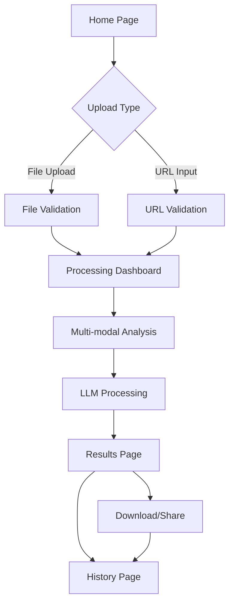

# Virality Clipper - Product Requirements Document

## 1. Product Overview
Virality Clipper is an AI-powered web application that automatically identifies and extracts viral segments from video content using multi-modal analysis.
- The platform combines audio transcription, visual analysis, and LLM intelligence to detect high-engagement moments and generate optimized clips with virality scores and social media recommendations.
- Target market: Content creators, social media managers, and digital marketers seeking to maximize video engagement across platforms.

## 2. Core Features

### 2.1 User Roles
| Role | Registration Method | Core Permissions |
|------|---------------------|------------------|
| Free User | Email registration | Process up to 5 videos per month, basic virality analysis |
| Premium User | Subscription upgrade | Unlimited processing, advanced analytics, batch processing |

### 2.2 Feature Module
Our Virality Clipper application consists of the following main pages:
1. **Home page**: hero section with value proposition, upload interface, URL input form.
2. **Processing dashboard**: real-time job status, progress indicators, queue management.
3. **Results page**: clipped video player, virality scores, hashtag suggestions, social media recommendations.
4. **History page**: previous clips library, analytics overview, download management.

### 2.3 Page Details
| Page Name | Module Name | Feature description |
|-----------|-------------|---------------------|
| Home page | Hero section | Display value proposition, key benefits, and call-to-action for video processing |
| Home page | Upload interface | Handle file uploads (drag-drop, browse), support multiple video formats (MP4, MOV, AVI) |
| Home page | URL input | Accept video URLs from YouTube, Vimeo, TikTok, and other platforms |
| Processing dashboard | Job status tracker | Real-time updates showing upload, analysis, clipping, and completion stages |
| Processing dashboard | Progress indicators | Visual progress bars, estimated time remaining, current processing step |
| Processing dashboard | Queue management | Display position in queue, cancel job option, priority processing for premium users |
| Results page | Video player | Embedded player for original and clipped videos with playback controls |
| Results page | Virality analysis | Display virality scores by niche (gaming, lifestyle, education, etc.) with explanations |
| Results page | Hashtag generator | AI-generated hashtags with copy-to-clipboard functionality and platform-specific suggestions |
| Results page | Social media optimizer | Recommended posting times, platform-specific formatting, engagement predictions |
| Results page | Download options | Multiple format downloads (MP4, GIF), quality settings, watermark options |
| History page | Clips library | Grid view of processed videos with thumbnails, dates, and quick actions |
| History page | Analytics dashboard | Performance metrics, virality trends, most successful clips |

## 3. Core Process

**Main User Flow:**
1. User uploads video file or provides URL on home page
2. System validates input and initiates processing job
3. User is redirected to processing dashboard to monitor progress
4. Multi-modal analysis pipeline processes video (audio transcription, visual analysis, temporal mapping)
5. LLM generates virality scores, hashtags, and social media recommendations
6. User receives notification when processing completes
7. Results page displays clipped video with all generated insights
8. User can download clips, copy hashtags, and save to history

**Premium User Flow:**
Same as main flow but with additional features like batch processing, priority queue, and advanced analytics.

## 4. User Interface Design

### 4.1 Design Style
- **Primary colors**: Deep purple (#6366F1) and electric blue (#3B82F6)
- **Secondary colors**: Neutral grays (#F3F4F6, #6B7280) with accent green (#10B981) for success states
- **Button style**: Rounded corners (8px), gradient backgrounds, subtle shadows with hover animations
- **Font**: Inter for headings (24px-48px), system fonts for body text (14px-16px)
- **Layout style**: Card-based design with clean spacing, top navigation with sidebar for dashboard
- **Icons**: Heroicons for consistency, video-specific icons for processing states

### 4.2 Page Design Overview
| Page Name | Module Name | UI Elements |
|-----------|-------------|-------------|
| Home page | Hero section | Large heading with gradient text, animated background, prominent CTA button |
| Home page | Upload interface | Drag-drop zone with dashed border, file type indicators, progress animation |
| Processing dashboard | Status tracker | Step-by-step progress with checkmarks, loading spinners, estimated time badges |
| Results page | Video player | Split-screen layout showing original vs clipped video, custom controls |
| Results page | Virality scores | Circular progress indicators, color-coded scores, expandable explanations |
| Results page | Hashtag section | Tag-style buttons with copy icons, platform logos, trending indicators |

### 4.3 Responsiveness
Desktop-first design with mobile-adaptive breakpoints at 768px and 1024px. Touch-optimized interactions for mobile devices including swipe gestures for video scrubbing and tap-to-copy for hashtags.